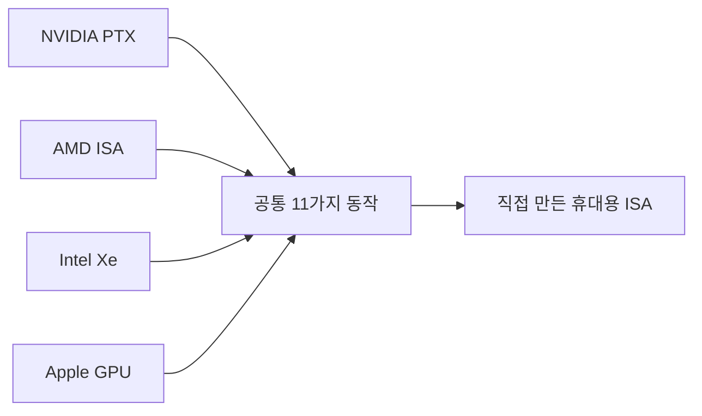

요즘 로컬 LLM 커뮤니티를 다시 들여다보면 Qwen 얘기가 또 슬그머니 올라와 있다. Qwen은 알리바바가 모델 가중치를 통째로 풀어버린 오픈웨이트 LLM — API로 빌려 쓰는 ChatGPT 같은 게 아니라, 내 컴퓨터로 파일을 받아 직접 돌리는 부류다. 이번엔 27B 규모 Qwen으로 HTML5 게임 콘솔 비슷한 걸 만들던 사람이 "생각보다 잘 따라오더라"는 후기를 올렸고, 그 아래엔 다음 버전 언제 나오냐고 기다리는 글이 또 붙었다. 정확한 버전 표기는 글마다 제각각이라 나도 어느 게 맞는지는 확신 못 하겠고.

근데 이게 좀 웃긴 게, 막상 그 게시판을 위에서 아래로 죽 긁어보니 정작 내 눈을 오래 잡은 건 Qwen이 아니었다. 모델 자랑글 바로 옆 칸에 결이 완전히 다른 글들이 아무렇지 않게 섞여 있더라. 어떤 학회가 논문 낼 만한 곳이냐 묻는 진지한 질문, 학부 졸업논문 주제 상담, "나 2학년인데 도대체 뭐부터 시작해야 하냐"는 막막한 하소연까지. 이 동네 특유의 풍경이다. 최신 모델 벤치 점수랑 사람 인생 고민이 한 화면에 같이 떠 있는.

그중 하나는 진짜 마음에 들었다. 어떤 사람이 NVIDIA PTX, AMD ISA 레퍼런스, 인텔 Xe, 심지어 리버스 엔지니어링한 애플 GPU 문서까지 — 16개 마이크로아키텍처에 걸쳐 5천 페이지 넘는 GPU 구조 매뉴얼을 그냥 취미로 읽었단다. ISA는 칩이 알아듣는 명령어 집합, 그러니까 하드웨어가 쓰는 모국어 같은 거다. 그렇게 파다 보니 "결국 네 회사 다 같은 11가지를 이름만 다르게 부르고 있더라"는 결론에 도달했고, 아예 자기만의 휴대용 GPU 명령어 집합을 만들어버렸다고.

5천 페이지를 읽고 난 사람만 할 수 있는 종류의 단순화다. 벤더마다 다른 척하지만 안을 까보면 다들 비슷한 일을 한다는 거. 사실은 모델 동네에서도 비슷한 소리를 자주 듣는다. 트랜스포머 변형이라는 게 결국 어텐션 한 덩어리에 살을 다르게 붙인 거 아니냐는 식으로.

*[AI generated (Pollinations · Flux)](https://pollinations.ai/)*

한편엔 수화 인식을 졸업논문 주제로 잡고 Mediapipe에 트랜스포머를 얹을지 고민하는 학부생도 있었고, "인터넷마다 3개월에 1억 벌게 해준다는데 난 뭐부터 해야 하냐"고 적은 2학년도 있었다. 솔직히 이 마지막 글이 제일 오래 남더라. 이 바닥에서 5년 넘게 굴러도, 나도 그 막막함이 어떤 건지 안다.

Qwen 다음 버전이 며칠 뒤 풀릴지, 27B에서 얼마나 더 똑똑해질지는 나도 궁금하다. 근데 그 게시판이 알려주는 건 좀 따로 있는 것 같다. 모델은 분기마다 갈아치워져도, 그 밑에서 매뉴얼 5천 페이지를 읽거나 뭐부터 할지 몰라 헤매는 사람은 늘 같은 자리에 있다는 거. 어느 쪽이 더 오래 남을진, 글쎄, 좀 더 지켜봐야 알 것 같다.

***

**참고**

- [[P] Built a portable GPU ISA after reading too many architecture manuals [P]](https://www.reddit.com/r/MachineLearning/comments/1to76tv/p_built_a_portable_gpu_isa_after_reading_too_many/)
- [[D] Is IEEE Workshop on Machine Learning for Signal Processing Reputable? [D]](https://www.reddit.com/r/MachineLearning/comments/1touia2/d_is_ieee_workshop_on_machine_learning_for_signal/)
- [What to use for Sign Language Recognition [R]](https://www.reddit.com/r/MachineLearning/comments/1tovz7r/what_to_use_for_sign_language_recognition_r/)
- [Augmented Equivariant Mesh Networks for Anatomical Mesh Segmentation (ICML 2026 Workshops) [R]](https://www.reddit.com/r/MachineLearning/comments/1tobtmu/augmented_equivariant_mesh_networks_for/)
- [Trouble exploring in ai/ml,idk where to being with [D]](https://www.reddit.com/r/MachineLearning/comments/1tomqcs/trouble_exploring_in_aimlidk_where_to_being_with_d/)