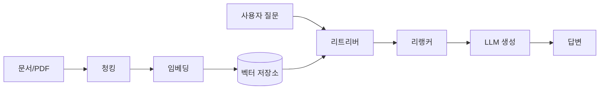

RAG 파이프라인을 제품에 한 번 붙여보면, 이게 단일 기능이 아니라 부품 여러 개가 줄줄이 엮인 조립 라인이라는 게 금방 와닿는다. RAG 는 Retrieval-Augmented Generation — 검색으로 끌어온 문서를 LLM 한테 같이 던져주고 그걸 근거로 답을 짓게 하는 방식이거든. 왜 굳이 이런 짓을 하냐면, GPT 든 Claude 든 학습이 끝난 시점 이후의 일이나 우리 회사 내부 위키 같은 건 모르기 때문이다. 모델 머릿속에 없는 지식을 시험장에서 옆에 컨닝페이퍼 슬쩍 쥐어주듯 붙여주는 것, 그게 RAG 의 본질이라고 보면 편하다.

근데 막상 굴려보면 부품 하나만 어긋나도 답 전체가 헛돈다. 내가 만져본 한에서 각 단계가 무슨 일을 하는지 순서대로 풀어볼게.



맨 앞은 문서를 잘게 자르는 청킹(chunking). PDF 한 권을 통째로 모델에 욱여넣을 순 없으니 문단이나 몇백 토큰 단위로 쪼갠다. 이게 은근 중요한 게, 너무 크게 자르면 검색이 뭉툭해지고 너무 잘게 자르면 맥락이 뚝뚝 끊겨. 나는 보통 500~800 토큰에 앞뒤를 살짝 겹치게(overlap) 자르는 걸로 시작하는 편인데, 정답은 데이터마다 다르더라.

그다음이 임베딩(embedding). 잘라낸 텍스트 조각을 숫자 벡터로 바꾸는 단계인데, "강아지"와 "반려견"이 좌표상 가까이 찍히도록 의미를 좌표로 옮기는 작업이라고 생각하면 그림이 그려질 거다. 이렇게 만든 좌표들을 쌓아두는 창고가 벡터 저장소(vector store) — Pinecone, Chroma, pgvector 같은 것들이 여기 속한다.


*[AI generated (Pollinations · Flux)](https://pollinations.ai/)*


이제 진짜 검색 차례. 사용자가 질문을 던지면 그 질문도 똑같이 벡터로 바꿔서, 창고에서 좌표가 가까운 조각 몇 개를 끄집어낸다. 이게 리트리버(retriever). 여기서 끝내도 굴러는 가는데, 단순 유사도 검색만으론 "비슷해 보이지만 사실 답은 아닌" 조각이 딸려 오기 마련이라 리랭커(reranker)를 한 번 더 태우기도 한다. 후보를 20개쯤 넓게 뽑아서 진짜 관련 있는 5개로 추리는 거름망 같은 거랄까.

마지막이 생성. 추려낸 조각들을 질문이랑 같이 프롬프트에 넣고 모델한테 "이 자료만 보고 답해" 하고 시키는 단계다.

```python
context = "\n\n".join(retrieved_chunks)
prompt = f"""아래 자료만 근거로 답해. 자료에 없으면 모른다고 해.

[자료]
{context}

[질문]
{question}"""
```

체감상 RAG 품질의 8할은 생성이 아니라 그 앞단, 그러니까 청킹이랑 검색에서 갈리더라. 답이 이상하게 나오면 모델을 더 비싼 걸로 바꾸기 전에 "애초에 맞는 조각을 가져오긴 했나"부터 의심하는 게 맞다. retriever 가 실제로 끌어온 조각을 눈으로 직접 찍어보면 대개 범인이 거기 있다.


*[AI generated (Pollinations · Flux)](https://pollinations.ai/)*


한계도 솔직히 분명하다. 검색이 정답 조각을 못 찾으면 모델은 모르는 채로 그럴듯하게 지어낸다 — 흔히 말하는 환각. 게다가 조각을 많이 넣을수록 토큰 비용이랑 응답 지연이 같이 뛰어서, 무작정 top-k 를 키우는 게 능사도 아니고.

요즘은 여기에 질문을 여러 갈래로 쪼개거나 검색-생성을 몇 번씩 반복하는 변형(다들 agentic RAG 라고 부르더라)도 쏟아지는데, 그건 기본 파이프라인이 일단 탄탄해야 의미가 붙는 얘기다. 화려한 변형에 손대기 전에 청킹 한 칸, 검색 한 칸씩 맞춰보는 게 먼저 아닐까 싶다.