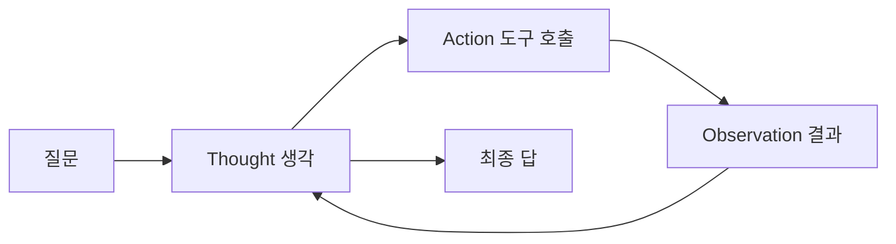

요즘 AI 에이전트 얘기할 때 빠지지 않고 나오는 게 ReAct 패턴이다. 이름이 좀 헷갈리는데 프론트엔드 React 랑은 전혀 상관없고 — Reasoning(추론) + Acting(행동) 을 붙인 말이다. (Yao et al., 2022) 논문에서 나온 개념인데, 한 줄로 줄이면 "LLM 한테 생각만 시키지 말고, 생각하고 → 도구 써보고 → 결과 보고 → 다시 생각하게" 만드는 방식이다.

왜 이게 필요하냐면. 그냥 질문 던지고 답 받는 LLM 은 머릿속으로만 끙끙대다 그럴듯한 거짓말(흔히 환각이라 부르는 것)을 뱉을 때가 많다. 근데 사람도 모르는 거 나오면 검색하고, 계산기 두드리고, 중간 결과 보고 방향을 튼다. ReAct 는 그 과정을 LLM 한테 그대로 흉내 내게 한 거다.

비유하면 요리할 때랑 비슷하다. 레시피를 머릿속으로만 외워서 한 방에 완성하는 사람은 없다. 간 보고("어, 좀 싱겁네"), 소금 더 넣고, 다시 간 보고. ReAct 의 루프가 딱 이거다.


구조는 생각보다 단순하다. Thought(생각) → Action(행동, 보통 도구 호출) → Observation(관찰, 도구가 돌려준 결과) 이 세 박자를 답이 나올 때까지 돈다.



실제 트레이스를 보면 이런 식으로 찍힌다:

```text
Thought: 작년 한국 1인당 GDP를 모르니 검색해야겠다
Action: search["Korea GDP per capita 2024"]
Observation: 약 36,000 달러
Thought: 이 정도면 충분, 답하면 되겠다
Action: finish["약 3만 6천 달러"]
```

내가 직접 LangChain 이나 그냥 raw API 로 굴려본 한에서는, ReAct 가 마법은 아니다. 도구가 엉뚱한 걸 돌려주면 모델이 그걸 그대로 믿고 산으로 가더라. Observation 이 틀리면 그 위에 쌓는 Thought 도 같이 틀어진다 — 쓰레기 들어가면 쓰레기 나온다는 그 얘기랑 똑같다.


*[AI generated (Pollinations · Flux)](https://pollinations.ai/)*


그래도 이 패턴이 오래 살아남는 이유는, 디버깅이 된다는 점인 것 같다. 모델이 왜 그 답을 냈는지 Thought 로그가 줄줄이 남으니까. 블랙박스가 조금은 유리 상자가 된다.

요즘은 함수 호출(function calling) 이 API 레벨에서 깔끔하게 지원되면서, Thought/Action 을 텍스트로 파싱하던 옛날 방식은 좀 촌스러워 보이기도 한다. 근데 본질은 안 변한 것 같다. 생각하고, 움직이고, 보고, 다시 생각하고. 이게 에이전트라는 단어의 거의 전부 아닌가 싶기도 하고. 이 루프를 어디까지 믿고 맡겨도 되는지는 좀 더 굴려봐야 알 것 같다.