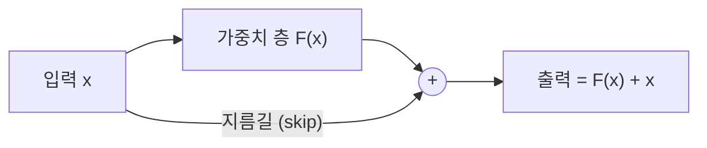

ResNet, 그러니까 잔차 연결(residual connection)이라는 아이디어를 처음 봤을 때 솔직히 좀 허무했다. 2015년 He 와 동료들이 낸 논문 한 편(He et al., 2015)이 그 뒤 거의 모든 비전 모델의 뼈대가 됐는데, 핵심 트릭은 의외로 한 줄이면 끝난다 — 층을 통과시킨 결과에 입력을 그냥 도로 더해버리는 것.

배경부터 짧게 짚자. 딥러닝에서 이미지를 다루는 신경망, 그러니까 CNN(합성곱 신경망 — 이미지를 작은 필터로 훑으며 특징을 뽑아내는 구조) 말인데, 다들 층을 깊게 쌓을수록 똑똑해질 거라 믿었다. 근데 막상 해보면 어느 지점부터는 층을 더 얹을수록 성능이 오히려 주저앉더라. 재밌는 건 과적합 탓이 아니었다는 점. 훈련 데이터에서조차 더 깊은 쪽이 더 못 맞혔으니까. 외워서 망한 게 아니라, 애초에 학습이 안 되던 거지. 나무 블록을 너무 높이 쌓다 어느 순간 탑 전체가 휘청대는 거랑 비슷한 그림.


*[AI generated (Pollinations · Flux)](https://pollinations.ai/)*


He 팀이 던진 질문이 좀 웃기다. "층 20개를 더 쌓아서 나빠질 거면, 그 20개가 입력을 하나도 안 건드리고 그냥 통과만 시켜도 최소 본전은 돼야 하는 거 아냐?" 근데 신경망한테 "아무것도 하지 마", 즉 항등 함수(들어온 그대로 내보내는 함수)를 학습시키는 게 생각보다 까다롭다. 0 이 아닌 수많은 가중치로 "아무 일도 안 일어난 척"을 흉내내야 하니까.

그래서 발상을 통째로 뒤집었다. 어떤 층이 내놔야 할 이상적인 출력을 H(x) 라고 하면, 원래 방식은 층더러 H(x) 를 통째로 배우라고 시킨다. 잔차 연결은 대신 F(x) = H(x) − x — "입력에서 얼마나 바꿀지"만 배우게 두고, 마지막에 원본 x 를 도로 얹는 식이지.

```
출력 = F(x) + x
```

이게 왜 세냐면, 그 층이 딱히 손댈 게 없을 땐 F(x) 를 0 으로만 보내면 그만이거든. 0 으로 미는 건 항등 함수를 처음부터 새로 배우는 것보다 훨씬 쉽다. 백지에 다시 쓰느니, 초안에 빨간 펜으로 고칠 데만 표시하는 게 편한 거랑 똑같다.


*[AI generated (Pollinations · Flux)](https://pollinations.ai/)*


그림으로 그리면 대충 이런 모양.



여기서 옆으로 슥 빠지는 화살표, 이걸 지름길(shortcut) 또는 skip connection 이라 부른다. 이 샛길 덕에 역전파(오차를 거꾸로 흘려보내 가중치를 고치는 과정)할 때 기울기가 층을 안 거치고도 곧장 아래로 흘러갈 통로가 생긴다. 깊은 망에서 기울기가 점점 작아지다 사라지는 문제(vanishing gradient)가 확 누그러지는 셈.

체감 인상도 적어두면, 직접 PyTorch 로 잔차 블록을 끼워봤을 때 이 한 줄 차이가 이렇게 크나 싶었다. 정말 더하기 한 번이 전부다. 코드로는 이 정도.

```python
def forward(self, x):
    identity = x
    out = self.conv2(self.relu(self.conv1(x)))
    out += identity          # 잔차 연결: 입력을 그대로 더한다
    return self.relu(out)
```

ResNet-152 — 152층짜리 괴물 — 이 전 세대 VGG(19층 남짓)보다 오히려 더 깔끔하게 학습됐고, 2015년 ImageNet 대회를 가져갔다. 정확한 에러율 수치는 솔직히 가물가물한데, 그 즈음 "기계가 사람보다 이미지 분류를 잘한다"고 화제가 됐던 기억은 또렷하다.

물론 만능은 아니지. 잔차 연결이 깊이를 공짜로 주는 건 아니고, 그냥 "깊게 쌓아도 망가지지 않을 길"을 터준 쪽에 가깝다. 요즘 Transformer 들도 이 skip connection 을 손 안 대고 거의 그대로 물려받아 쓰더라. 더하기 하나가 벌써 10년을 버틴 셈인데, 다음 자리를 뭐가 채울진 — 글쎄, 좀 더 지켜봐야 할 것 같다.