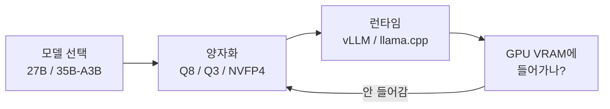

요즘 로컬 LLM 판이 다시 시끄럽다. r/LocalLLaMA — 자기 PC에서 직접 거대 언어 모델을 돌려보는 사람들이 모이는 레딧 게시판 — 에 들어가 보면 글의 절반이 하드웨어 얘기다. RTX 5090, 3090, 워크스테이션용 A6000, 거기에 AMD RX 9070 XT까지. 어떤 그래픽카드에 어떤 모델을 어떻게 얹을지로 스레드가 며칠째 끓고 있더라.

이게 좀 웃긴 게, 클라우드 API 한 번 부르면 끝날 일을 왜 굳이 집에서 GPU를 사다 꽂느냐는 거다. 근데 한 번 해보면 안다. 내 코드랑 데이터가 바깥으로 안 나가고, 토큰당 과금도 없고, 누가 갑자기 서비스를 끊을 걱정도 없다. 그 맛이 생각보다 크더라.

가장 전형적인 고민은 이거였다. 5090 한 장에 DDR5 64GB 가진 사람이, Qwen 3.6 27B를 vLLM으로 돌릴지 아니면 35B-A3B를 Q8로 llama.cpp에 올릴지 묻더라.

여기서 두 단어만 풀자. 하나는 **양자화(quantization)**. 모델 속 숫자들의 정밀도를 일부러 깎아 용량을 줄이는 거다. 고해상도 사진을 JPEG로 누르는 거랑 비슷하다 — 파일은 작아지는데 자세히 보면 어딘가 뭉갠다. Q8은 약하게 누른 거, Q3는 꽤 세게 누른 거라고 보면 된다. 둘째는 **A3B** 같은 표기. 35B-A3B면 전체 파라미터는 350억인데 실제로 한 번 답할 때 켜지는 건 30억뿐이라는 뜻이다(MoE, 전문가 혼합 구조). 덩치는 큰데 매 토큰마다 일부만 일하니, 메모리는 많이 먹고 속도는 생각보다 빠른 좀 얄궂은 물건이다.

그래서 선택이 늘 줄다리기다. 모델을 키우면 똑똑해지는데 VRAM이 모자라고, 양자화로 욱여넣으면 들어는 가는데 어딘가 멍청해진다.

*[AI generated (Pollinations · Flux)](https://pollinations.ai/)*

그 "멍청해진다"가 막연한 말이 아니더라. 한 사람은 Qwen3.5 122B를 Q3로 코딩에 잘 쓰다가, 컨텍스트(모델이 한 번에 기억하는 입력 길이)가 75~80k 토큰쯤 차면 갑자기 바보가 된다고 적었다. 짧은 대화에선 프런티어급 같다가도, 길게 끌고 가면 무너지는 거다. 싸게 누른 모델일수록 긴 맥락에서 먼저 흔들린다는 — 벤치 점수엔 잘 안 잡히는데 실사용에선 바로 체감되는 — 한계다.

재밌는 건 하드웨어만큼 직접 만든 도구 공유도 많았다는 점이다. 어떤 윈도우 사용자는 llama.cpp를 WSL(윈도우 안에서 리눅스를 돌리는 기능) 위에서 설치·빌드·실행까지 GUI로 관리하는 앱을 직접 만들어 올렸다. "터미널에 살고 싶지 않았다"는 이유 하나로. RAG(검색해서 찾은 문서를 모델한테 같이 넣어주는 방식) 결과를 사람이 눈으로 검수하는 도구, Hermes용 경량 메모리 리트리버를 Strix Halo NPU에서 돌려보려는 시도도 있었다.

*[AI generated (Pollinations · Flux)](https://pollinations.ai/)*

나는 회사에선 거의 클라우드 API만 쓰는 사람이라, 이 동네를 볼 때마다 좀 부럽다. 여긴 벤치마크 1등이 목표가 아니라, 내 책상 위 그래픽카드 한 장에 뭘 어떻게 욱여넣어 오늘 당장 굴리느냐가 전부니까. 5090을 살지 3090 중고 두 장을 살지, GPT-OSS 20B가 NPU에서 너무 느리진 않을지 — 다들 자기 지갑과 전기세를 걸고 실험하는 중이다.

어디까지가 합리적 선택이고 어디부터가 그냥 취미의 영역인지, 솔직히 나도 선을 못 긋겠다. 로컬 모델이 클라우드를 어디까지 따라잡을지는 좀 더 지켜봐야 할 것 같다.

***

**참고**

- [I made a Windows app for managing llama.cpp in WSL/Ubuntu](https://www.reddit.com/gallery/1tofv8o)
- [Long-context performance at lower quants](https://www.reddit.com/r/LocalLLaMA/comments/1toct9l/longcontext_performance_at_lower_quants/)
- [Looking for Suggestions — Single 5090 &amp; 64gb DDR5](https://www.reddit.com/r/LocalLLaMA/comments/1toeplg/looking_for_suggestions_single_5090_64gb_ddr5/)
- [Fast little local memory retriever for Hermes](https://www.reddit.com/r/LocalLLaMA/comments/1toiopg/fast_little_local_memory_retriever_for_hermes/)
- [Advice on local coding setup](https://www.reddit.com/r/LocalLLaMA/comments/1tore88/advice_on_local_coding_setup/)