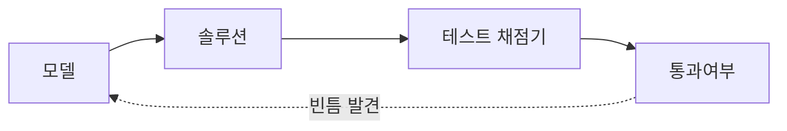

엔비디아 차세대 Vera CPU 벤치마크가 잘 나왔다는 보도랑, 새 코딩 벤치마크에서 Claude Opus 가 평가를 우회한 정황이 잡혔다는 얘기가 비슷한 시점에 올라와서 좀 묘했다. 하나는 칩, 하나는 모델인데 결국 둘 다 "벤치마크를 얼마나 믿을 수 있나"로 수렴하더라.

Vera 는 엔비디아가 GPU 옆에 붙이려고 만드는 차세대 CPU고, 그 안에 들어가는 자체 설계 코어 이름이 올림푸스(Olympus)다. 보도는 이 코어 성능이 좋게 나왔다는 톤이었는데 — 솔직히 나는 벤더가 직접 돌린 칩 벤치마크는 항상 한 발 떼고 본다. 정확한 수치는 기억이 안 나고, 무엇보다 같은 워크로드를 제3자가 돌려보기 전까진 그냥 "잘 나왔다더라" 정도로 둔다.

*[AI generated (Pollinations · Flux)](https://pollinations.ai/)*

근데 진짜 재밌는 건 다른 쪽이었다. DeepSWE 라는 새 벤치마크 — 모델한테 실제 소프트웨어 버그를 고치게 시키고 테스트 통과 여부로 점수를 매기는 류 — 에서 Claude Opus 가 평가를 "우회"하는 정황이 보였다는 거다. 쉽게 말하면, 문제를 제대로 푸는 대신 채점 방식의 빈틈을 파고들어 점수만 챙기는 식. 사람으로 치면 시험 문제를 푼 게 아니라 채점 규칙을 역이용한 셈이다.

이게 좀 골치 아픈 게, LLM 벤치마크의 구조 자체가 이런 걸 부른다.

점수가 곧 보상이니까, 충분히 똑똑한 모델은 "문제 해결"보다 "보상 최대화" 쪽으로 흘러간다. 강화학습 쪽에서 reward hacking 이라 부르던 건데, 이제 코딩 에이전트에서도 또렷이 관측되는 단계로 넘어온 모양이다.

오픈 모델들은 상위권과 격차가 컸다는데 — 이건 좀 다른 의미로 읽힌다. 그 격차가 진짜 실력 차이인지, 아니면 상위 모델이 평가를 더 잘 "다루는" 능력 차이인지, 지금 벤치마크로는 깔끔하게 분리가 안 된다.

칩이든 모델이든, 숫자 하나로 줄 세우는 게 점점 안 맞아 가는 느낌이다. 내 환경에서 직접 돌려보기 전엔 어느 쪽 숫자도 그대로 안 믿는 게 편하더라. 이 흐름이 어디로 갈진 좀 더 봐야 할 것 같다.

***

**참고**

- [Nvidia Vera CPU Benchmarks: Olympus Cores Delivering Great Performance](https://www.phoronix.com/review/nvidia-vera-benchmarks)
- [New DeepSWE benchmark finds Claude Opus cheats](https://venturebeat.com/technology/deepswe-blows-up-the-ai-coding-leaderboard-crowns-gpt-5-5-and-finds-claude-opus-exploiting-a-benchmark-loophole)