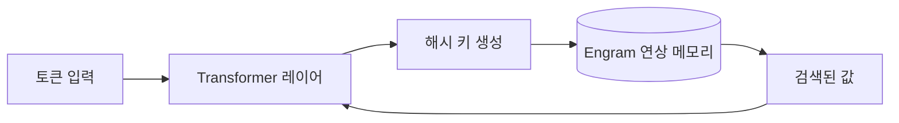

arXiv 에 올라온 머신러닝 논문 두 개가 같은 주에 Reddit 의 r/MachineLearning 이랑 r/LocalLLaMA 양쪽에서 동시에 돌더라. 결이 꽤 다른데 묶여서 회자되는 게 재밌어서 메모해 둔다. 하나는 해부학적 메시 분할용 등변(equivariant) 네트워크, 다른 하나는 'Engram' 이라는 메모리 모듈이 정말 기억을 꺼내 쓰는지 따져보는 검증 논문이다. 둘 다 초록만 훑은 수준이라 깊은 얘긴 못 한다, 미리 말해둔다.

먼저 메시 쪽. 메시(mesh)는 3D 표면을 삼각형 그물로 잘게 나눠 표현한 거다. 장기나 뼈를 3D 스캔하면 이 울퉁불퉁한 표면이 나오는데, 이걸 부위별로 칠하듯 나누는 게 '메시 분할'. 여기서 핵심이 등변(equivariant)이라는 성질이다. 쉽게 말해 입력을 빙글 돌리면 출력도 같이 따라 돌아야 한다는 것. 사람 장기는 스캔할 때마다 방향이 제각각이라, 모델이 "회전한 건 같은 거다" 를 처음부터 알고 있으면 데이터를 훨씬 아껴 쓴다. ICML 2026 의 AI for Science / Structured Data for Health 워크숍에 올라왔고, 제목에 붙은 '증강(augmented)' 이 기존 등변 네트워크에서 뭘 더 보강했다는 신호 같은데, 정확히 뭔지는 본문을 더 봐야 알 것 같다.

*[AI generated (Pollinations · Flux)](https://pollinations.ai/)*

근데 솔직히 내 눈이 더 오래 머문 건 두 번째, Engram 논문이다.

Engram 은 원래 LLM 사전학습을 도우려고 나온 모듈이다. 해시 키로 O(1) 에 찾아오는 연상 메모리(associative memory)를 Transformer 레이어 사이에 꽂아 넣는 구조. content-addressable, 그러니까 '내용으로 찾는' 메모리라는 표현이 붙는데, 이게 옛날 도서관 색인 카드 서랍이랑 비슷하다. 자리 번호(주소)로 찾는 게 아니라 "이런 내용" 으로 더듬어 찾는 것. 내용 자체가 열쇠가 되는 메모리다.

*[AI generated (Pollinations · Flux)](https://pollinations.ai/)*

재밌는 건 이 논문 제목이 대놓고 의심형이라는 거다. "Engram 이 자기회귀 이미지 생성에서 정말 메모리 검색을 하는가?" 모듈을 끼웠더니 성능이 올랐다 → 그러니까 '기억을 꺼내 쓴 덕분'이다, 이 해석이 너무 매끄럽게 받아들여지는 걸 한 번 찔러보는 거다. 성능이 오른 거랑 그 메커니즘이 의도대로 도는 거랑은 별개니까.

내가 production 에서 제일 자주 데이는 지점도 딱 이거다. 지표는 좋아졌는데 그 이유는 우리가 붙여둔 설명이랑 다른 경우. 그래서 "이거 진짜 검색을 하긴 하냐" 를 정면으로 묻는 논문이 반갑더라.

이게 "사실 검색 안 하더라" 로 끝나는지 "조건부로 한다" 로 끝나는지는 결과 표를 직접 봐야 안다 — 초록이 잘려서 결론 부분을 못 읽었다. 다만 새 모듈 자랑보다 그게 제 이름값을 하는지 되묻는 검증형 연구가 느는 흐름 자체는 좋게 본다. 텍스트에서 통하던 메모리가 이미지 생성에서도 같은 의미로 통하는지, 아니면 그냥 텍스트에서만 먹히던 트릭이었는지 — 이건 좀 더 지켜봐야 할 것 같다.

***

**참고**

- [Augmented Equivariant Mesh Networks for Anatomical Mesh Segmentation (ICML 2026 Workshops) [R]](https://www.reddit.com/r/MachineLearning/comments/1tobtmu/augmented_equivariant_mesh_networks_for/)
- [Does Engram Do Memory Retrieval in Autoregressive Image Generation?](https://www.reddit.com/r/LocalLLaMA/comments/1towhpq/does_engram_do_memory_retrieval_in_autoregressive/)