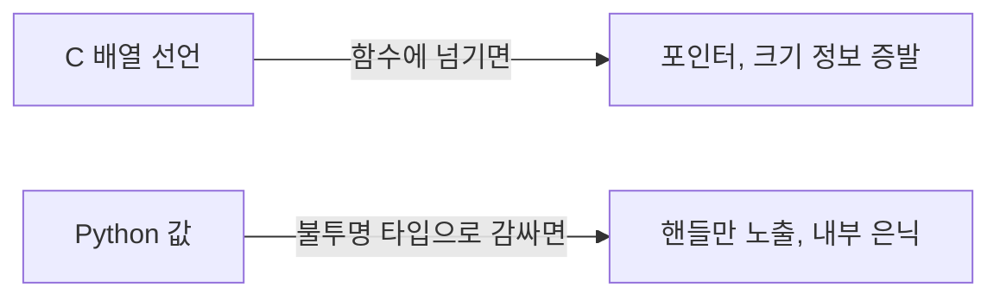

타입 시스템 얘기 꺼내면 다들 슬슬 졸기 시작하는데, 사실 C의 배열 타입과 Python의 불투명 타입(opaque type) — 내부 구조를 일부러 가려놓은 타입 — 이 둘을 나란히 놓고 보면 의외로 재밌다. 어제 HackerNews 메인에 두 글이 거의 동시에 올라왔더라. 한쪽은 타입이 제 정체를 들켜버리는 얘기, 다른 쪽은 끝까지 안 들키게 감추는 얘기. 정반대인데 묘하게 짝이 맞았네.

먼저 C 배열. `int a[10]`이라고 쓰면 이건 "정수 10개짜리 배열"이라는 어엿한 타입이지. 근데 이걸 함수에 넘기는 순간 정체가 흐물흐물 녹아버린다.

```c
void f(int a[10]) {
    printf("%zu\n", sizeof a);  // 40 나올 것 같지? 그냥 8 (포인터 크기)
}
```

이게 좀 웃긴 게, 파라미터에 `int a[10]`이라고 분명히 적었는데 컴파일러는 그걸 슬쩍 `int *a`로 바꿔치기한다. 배열이 포인터로 "변질(decay)"된다는 그 유명한 규칙. 그래서 함수 안에서 `sizeof`를 찍으면 배열 전체가 아니라 포인터 한 칸 크기가 튀어나오는 거다. 적어둔 숫자 10은 주석이나 다름없이 무시되고.

비유하자면 큰 택배 상자를 통째로 건넸는데, 받는 사람 손엔 상자는 없고 "그거 저쪽 창고 3번 선반에 있음"이라고 적힌 쪽지 한 장만 남는 격이지. 상자가 얼마나 컸는지에 대한 정보는 그 순간 증발한다.


*[AI generated (Pollinations · Flux)](https://pollinations.ai/)*


반대편 Python의 불투명 타입은 정확히 그 반대를 노린다. 일부러 안을 못 보게 막는 거다. 내가 이해한 선에서는, 핸들이나 토큰 하나만 쥐여주고 "안은 들여다보지 마, 정해준 함수로만 다뤄"라고 못박는 패턴.

```python
from typing import NewType
UserId = NewType("UserId", int)   # 런타임엔 그냥 int, 타입 체커한텐 별개 종족
```

이렇게 해두면 `UserId`랑 평범한 `int`를 섞어 쓰려는 순간 타입 체커가 잡아준다. C 확장 쪽 `PyCapsule`도 결이 비슷한데, C 포인터를 파이썬 객체로 감싸 넘기되 파이썬 코드는 그 속을 절대 못 까보게 막아두는 식이고.



왜 이게 남 얘기가 아니냐면 — 나도 production에서 LLM 클라이언트나 모델 핸들을 감쌀 때 딱 이 짓을 한다. 안쪽 구현은 숨기고 얇은 인터페이스만 바깥에 내놓는 거지. 그래야 나중에 내부를 갈아엎어도 갖다 쓰는 쪽 코드가 안 깨지거든. 불투명 타입은 그 습관을 타입 시스템 수준에서 강제해주는 셈.


*[AI generated (Pollinations · Flux)](https://pollinations.ai/)*


재밌는 건 방향이 정반대라는 점이야. C는 감추려던 정보(배열 크기)가 본인도 모르게 새어나가고, Python은 안 보이게 막으려고 일부러 애쓴다. 같은 "타입"이라는 단어를 쓰는데 한쪽은 못 믿을 친구고 한쪽은 입 무거운 친구인 셈이지.

어느 쪽 설계가 더 맞는 건진 잘 모르겠다. C의 decay도 그 시절 메모리·성능 사정을 떠올리면 나름 합리적인 타협이었을 테고. 다만 둘 다 "타입은 보이는 게 다가 아니다"라는 같은 교훈을 정반대 방향에서 가리키고 있는 건 분명해 보인다. 이런 미묘함을 알고 쓰는 거랑 모르고 당하는 거랑은, 디버깅하는 새벽 3시에 체감이 확 갈리더라.

***

**참고**

- [C array types are weird](https://anselmschueler.com/blogposts/2025-c-pointers/)
- [Opaque Types in Python](https://blog.glyph.im/2026/05/opaque-types-in-python.html)