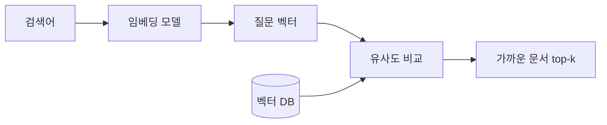

임베딩과 벡터 검색. 요즘 RAG니 시맨틱 서치니 하는 말 뒤에 거의 항상 깔려 있는 두 개념인데, 막상 "그래서 임베딩이 뭔데?" 하고 물으면 설명이 갑자기 추상적으로 흐르더라. 내가 제품에 붙여보면서 이해한 선에서 한 번 풀어볼게.

임베딩(embedding)은 한 줄로 말하면 단어나 문장 같은 걸 **숫자 묶음(벡터)으로 바꾸는 일**이다. 예를 들어 "강아지"라는 단어를 `[0.21, -0.88, 0.05, ...]` 처럼 수백 개 숫자로 표현하는 거지.

왜 이런 짓을 하냐. 컴퓨터는 "강아지"랑 "개"가 비슷한 말이라는 걸 글자만 봐선 모르거든. 근데 둘을 벡터로 바꿔놓으면 그 두 점이 공간에서 가까이 붙는다. 의미가 비슷할수록 가까운 좌표를 받는 것, 이게 임베딩의 핵심이지.

비유를 하나 들면 거대한 지도를 떠올려봐. "강아지"와 "고양이"는 가까운 동네에, "강아지"와 "양자역학"은 지도 반대편에 찍혀 있는 셈. 다만 이 지도는 우리가 보는 2차원이 아니라 보통 수백~수천 차원이라 머릿속에 그림으론 안 그려진다.


그럼 벡터 검색은 뭐냐. 내가 "귀여운 반려동물"이라고 검색하면 이 문장도 똑같이 벡터로 바꾼 다음, 미리 벡터로 저장해둔 문서들 중에서 **가장 가까운 점들**을 찾아 꺼내오는 거다. 키워드가 한 글자도 안 겹쳐도 뜻만 비슷하면 걸린다는 게 포인트. 옛날 검색이 "단어 일치"였다면 이건 "뜻 일치"에 가깝다고 보면 돼.

가까운 정도를 재는 데는 보통 코사인 유사도를 쓰는데, 두 벡터가 이루는 각도가 좁을수록 비슷하다고 판단해. 흐름을 그림으로 보면 이렇다.



코드로는 생각보다 단순하다. 허깅페이스 모델 하나면 몇 줄로 끝나거든.

```python
from sentence_transformers import SentenceTransformer
m = SentenceTransformer("intfloat/multilingual-e5-small")
vecs = m.encode(["강아지", "개", "양자역학"])
```


*[AI generated (Pollinations · Flux)](https://pollinations.ai/)*


직접 써본 인상은, 진입은 쉬운데 운영이 은근 까다롭더라는 것. 솔직히 문서를 어느 단위로 쪼개 넣느냐(청킹)에 따라 결과가 확 갈린다. 너무 길게 넣으면 한 벡터 안에 여러 주제가 뭉개지고, 너무 잘게 넣으면 맥락이 끊겨버려. 어떤 임베딩 모델을 쓰느냐, 차원이 몇이냐도 검색 품질에 그대로 직결되고.

한 가지 오해도 짚고 싶은데, 벡터 검색이 의미를 "이해"하는 건 아니라는 점. 그냥 비슷한 패턴의 좌표를 가까이 모아둔 것뿐이라, 정반대 뜻인데 표현이 닮았다는 이유만으로 가깝게 잡히는 경우도 종종 본다. 이 부분은 나도 더 파봐야 할 것 같고.

여기까지가 기초. 실제로 RAG 같은 데 붙일 땐 여기서 리랭킹이니 하이브리드 검색이니 한 겹 더 얹게 되는데, 그건 다음에 따로 정리해보든가 해야겠다.