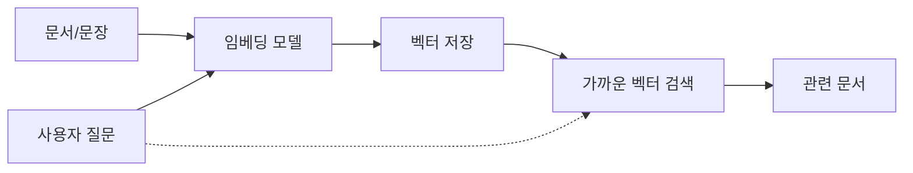

임베딩(embedding)이 대체 뭔지 한 번 제대로 정리하고 싶었다. RAG니 벡터 검색이니 하는 얘기마다 빠지지 않고 튀어나오는 단어인데, 나도 처음엔 "글자를 숫자로 바꾸는 거" 정도로만 알고 대충 넘어갔거든.

근데 핵심은 '숫자로 바꾼다'가 아니라 '의미가 가까우면 숫자도 가깝게 바꾼다'에 있더라.

비유를 하나 들면 지도다. 서울이든 부산이든 위도·경도 두 숫자만 있으면 지구 위 한 점으로 콕 찍히잖아. 가까운 도시는 좌표도 가깝고. 임베딩도 발상은 비슷한데, 단어나 문장 하나를 숫자 두 개가 아니라 수백~수천 개로 찍는다는 게 다를 뿐이지. 그 숫자 묶음(=벡터)이 곧 그 텍스트의 '좌표'인 셈.

그래서 '강아지'와 '개'는 공간상 거의 붙어 있고, '강아지'와 '주식 시장'은 멀찍이 떨어진다. word2vec 시절 유명한 예시로 "왕 − 남자 + 여자 ≈ 여왕"이라는 벡터 연산이 실제로 얼추 맞아떨어졌는데, 의미가 좌표 위 방향과 거리로 표현된다는 걸 눈으로 보여주는 장면이라 꽤 인상적이었지.

그럼 이 좌표는 누가 찍어줄까. 텍스트를 통째로 임베딩 모델에 넣으면 벡터가 툭 나오거든. 요즘은 직접 학습할 일 거의 없고 잘 만들어진 모델 갖다 쓰면 된다 — 코드로 보면 이 정도로 짧다:

```python
from sentence_transformers import SentenceTransformer
model = SentenceTransformer("all-MiniLM-L6-v2")
vec = model.encode("강아지가 공을 물고 뛰어왔다")  # 길이 384짜리 벡터
```

이렇게 뽑은 벡터를 미리 쌓아두고, 질문이 들어오면 질문도 같은 식으로 벡터로 바꿔서 '가장 가까운 좌표'를 찾는 게 RAG 검색의 뼈대다.



체감상 재밌는 건, 키워드가 한 글자도 안 겹쳐도 의미만 비슷하면 잡힌다는 점이다. "환불 어떻게 해요"랑 "결제 취소 방법" 사이엔 공통 단어가 하나도 없는데 벡터 거리는 가깝게 나오더라. 키워드 매칭만 하던 옛날 검색이라면 절대 못 엮었을 둘이지.

물론 만능은 아니다. 일반 모델을 의료나 법률처럼 좁고 전문적인 도메인에 그대로 들이밀면 좌표가 좀 뭉개지는 느낌이 있고, 한국어는 영어만큼 잘 되는 모델이 아직 적은 편. 이쪽은 내가 전부 검증해본 게 아니라 단정은 못 하겠다.

어쨌든 임베딩을 '의미를 좌표로 옮기는 작업'이라고 머릿속에 한 줄로 박아두면, 그 뒤에 따라붙는 벡터DB니 청킹이니 하는 얘기가 한결 수월하게 들어오더라. 나도 여기까지 오는 데 한참 걸렸네.