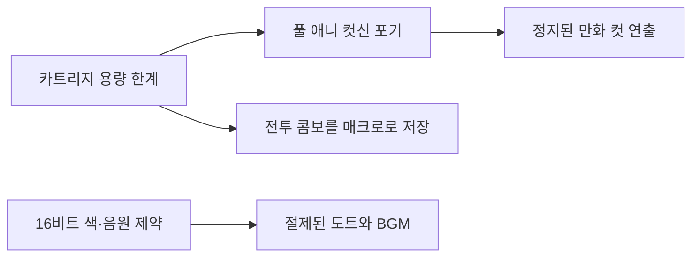

판타시 스타 IV — 1993년 세가 메가드라이브로 나온 RPG — 의 당시 개발자 인터뷰가 번역돼 돌아다니길래 어젯밤에 앉은 자리에서 다 읽어버렸다. 메가드라이브가 뭔지 가물가물한 사람을 위해 한 줄 보태면, 90년대 초 세가가 닌텐도 슈퍼패미컴과 맞붙던 16비트 게임기다. 지금 폰 에뮬레이터로 한 번쯤 켜봤을, 그 두툼한 픽셀 게임들이 돌아가던 기계.

솔직히 나는 이 게임을 실시간으로 해본 세대는 아니다. 근데 AI 제품에 모델 붙이는 일 하는 내가 왜 30년 전 RPG 인터뷰를 정독했냐면 — 거기 나오는 얘기가 처음부터 끝까지 "제약 안에서 뭘 포기하고 뭘 살릴까" 였기 때문이다. 이게 좀, 일하면서 매일 하는 고민이랑 너무 똑같아서 남 일 같지가 않더라.

*[AI generated (Pollinations · Flux)](https://pollinations.ai/)*

당시 카트리지에 들어가는 용량은 지금 기준으론 우습다. 정확한 수치는 기억이 가물가물한데, 요즘 사진 한 장이 그 시절 게임 한 통보다 클 거다. 그 좁은 방에 RPG 한 편을 통째로 욱여넣어야 했다. 스토리, 전투, 음악, 도트 그림 전부 다.

인터뷰에서 제일 인상 깊었던 건, 이 제약이 오히려 게임의 개성을 만들었다는 점이다. 풀 애니메이션 컷신을 넣을 자리가 없으니까, 정지된 만화 컷으로 이야기를 끊어 보여주는 연출을 택했다. 말풍선 박힌 컷이 탁탁 넘어가는 식. 용량을 아끼려던 어쩔 수 없는 선택이, 결과적으로 이 시리즈의 시그니처 비주얼이 됐다는 게 재밌다.

*[AI generated (Pollinations · Flux)](https://pollinations.ai/)*

엔지니어 눈으로 보면 이건 전형적인 트레이드오프 트리다. 위쪽에 제약 하나가 박히면, 그 아래로 결정들이 우수수 갈라져 내려온다.

전투도 그렇다. 내가 본 한에선 이 게임, 자주 쓰는 콤보를 매크로로 저장해두고 한 번에 불러오는 시스템이 있었다. 매 턴 똑같은 커맨드 누르는 노가다를 줄이려는 장치인데 — 이거, 지금 우리가 프롬프트 템플릿 저장해놓고 갖다 쓰는 거랑 발상이 완전히 똑같잖아. 반복을 줄이는 인터페이스. 30년 전 도트 게임이나 지금 LLM 도구나, 사람이 귀찮아하는 지점은 별로 안 변한 것 같다.

재밌는 건, 인터뷰 톤에 비장함이 거의 없다는 거다. "이게 마지막 편이니 다 갈아넣자" 같은 거창한 선언보다, 데드라인에 쫓기고 메모리가 모자라서 뭘 잘라냈는지를 담담하게 얘기한다. 나는 이런 회고가 잘 빠진 마케팅 보도자료보다 백 배 더 믿음이 간다. 진짜로 만들어본 사람만 할 수 있는 얘기라서.

*[AI generated (Pollinations · Flux)](https://pollinations.ai/)*

물론 미화하려는 건 아니다. 제약이 항상 명작을 낳지는 않는다. 똑같이 용량에 쪼들렸어도 그냥 잊힌 게임이 훨씬, 압도적으로 많다. 다만 제약을 핑계로 쓰지 않고 설계의 입력값으로 받아들인 팀은, 그 흔적이 결과물에 고스란히 남는 것 같다. 지금 우리가 토큰 한도, 지연시간, 비용에 쪼들리며 만들고 있는 것들도 몇 년 뒤에 누가 회고하면 비슷하게 읽힐까. 그건 좀 더 두고 봐야 알 것 같다.

***

**참고**

- [The worst job interview I ever had](https://www.oliverio.dev/blog/the-worst-job-interview-i-had)
- [Phantasy Star IV – 1993 Developer Interviews](https://shmuplations.com/phantasystariv/)