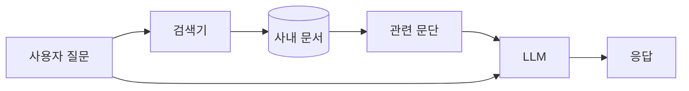

파인튜닝과 RAG, 둘 중 뭘 골라야 하냐는 질문을 회사 들어와서 정말 자주 받는다. 정확히는 "이거 파인튜닝하면 되죠?" 라고 묻는 사람이 절반, "검색 붙이는 방식만으로 충분할까요?" 가 나머지 절반쯤. 답이 매번 같지 않아서 좀 머뭇거리게 되는데, 내가 본 한에서는 고르는 기준이 의외로 단순한 편이더라.

두 방식을 비유로 풀면 이렇다. 파인튜닝은 시험 전날 교재를 통째로 외우는 거. 모델 가중치 자체를 살짝 옮겨서 "이 분야 말투" 나 "이 형식" 을 몸에 새겨 넣는다. 반대편의 검색 증강 생성 — 줄여서 RAG — 은 책 펴 놓고 시험 보는 쪽. 질문이 들어올 때마다 외부 문서를 잠깐 찾아서 프롬프트에 같이 끼워 넣어 주지. 같은 모델이라도 입력이 달라지니 답도 달라지는 원리.

*[AI generated (Pollinations · Flux)](https://pollinations.ai/)*

내가 실무에서 쓰는 갈림 기준은 대충 세 갈래쯤. 첫째, **지식이 자주 바뀌면 검색 쪽**. 가중치를 바꿔서 "어제 들어온 사내 매뉴얼" 을 외우게 하려면 학습을 매번 돌려야 하잖아. 비싸고 느리지. 문서 인덱스만 다시 만들면 끝나는 쪽이 압도적으로 편한 편. 둘째, **스타일이나 출력 형식이 핵심이면 학습 쪽**. 예를 들어 항상 JSON 으로, 항상 회사 톤으로, 항상 특정 카테고리 라벨로 — 이런 건 검색으로는 잘 안 박힌다. 모델 자체에 새겨야 들어가더라. 셋째, **둘 다 해도 된다**. 사실은 둘이 배타적인 게 아니라 같이 쓸 때 가장 강한 조합이 나오는 경우가 많다.

체감상 사람들은 파인튜닝을 너무 빨리 꺼낸다. 일단 검색부터 붙여 보고, 그래도 답이 어색하거나 형식이 안 맞으면 그때 모델을 만지는 순서가 안전하지 — 학습 데이터 모으는 시간이 보통 가장 비싸니까. 솔직히 사내에서 학습까지 간 케이스를 손에 꼽을 정도.

*[AI generated (Pollinations · Flux)](https://pollinations.ai/)*

한계도 분명 있긴 있다. 검색 쪽은 인덱스에 없는 질문이 들어오면 그냥 모른다. 임베딩 품질이 별로면 엉뚱한 문단을 끌어와서 헛소리를 만들어내기도 하고. 반대로 가중치를 바꾸는 쪽은 한 번 새기면 되돌리기가 번거롭지. 새 정보가 들어와도 모델이 "예전 답" 을 고집하는 일이 종종 생긴다더라.

그래서 요즘 누가 물으면 일단 이렇게 답한다. "검색부터 붙여 봐요. 그래도 안 되면 그때 얘기해요." 매번 통하는 답은 아니지만, 적어도 출발선에서는 거의 안 틀리는 편.