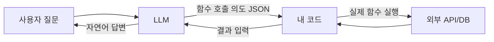

Function calling — LLM 한테 "그냥 답하지 말고 내가 정해둔 함수 중에 하나를 골라서 인자까지 채워달라" 고 부탁하는 기능 — 이게 요즘 AI 에이전트의 거의 모든 기초 토대거든. 처음 OpenAI 가 2023년에 공식 기능으로 내놓을 때만 해도 그냥 신기한 토이 같았는데, 지금은 Claude, Gemini, 오픈소스 모델까지 거의 다 지원하는 사실상의 표준이 돼버렸지.

비유로 풀자면 이렇게 봐. 내가 챗봇한테 "내일 서울 날씨 어때?" 하고 물으면, 옛날 모델은 자기 머릿속 지식으로 "글쎄... 5월이니까 따뜻하지 않을까요" 식으로 둘러댔어. function calling 이 들어가면 다르지 — 모델한테 미리 `get_weather(city, date)` 같은 함수의 존재를 알려주면, 모델은 "아 이건 내가 답할 게 아니라 그 함수를 city=Seoul, date=tomorrow 로 불러달라" 라고 JSON 으로 회신해. 마치 손님이 메뉴판 보고 점원한테 "이거 시켜주세요" 하는 거랑 비슷해.


여기서 헷갈리기 쉬운 게 하나 있는데 — **모델이 직접 함수를 실행하는 건 아니야.** 모델은 그냥 "이 함수를, 이런 인자로, 부르고 싶다" 라는 의도만 JSON 으로 뱉어. 실제로 그 함수를 돌리는 건 우리가 짜놓은 코드의 몫이고, 결과를 다시 모델한테 "이게 답이야" 하고 돌려주면 모델이 그제서야 사람한테 보여줄 자연어 답변을 만들어내는 구조거든.

흐름을 그림으로 보면 이런 느낌.



함수 정의는 JSON Schema 로 넘기는데, OpenAI 든 Claude 든 거의 비슷한 모양이야.

```python
tools = [{
    "name": "get_weather",
    "description": "특정 도시의 특정 날짜 날씨를 조회한다",
    "input_schema": {
        "type": "object",
        "properties": {
            "city": {"type": "string"},
            "date": {"type": "string", "description": "YYYY-MM-DD"}
        },
        "required": ["city", "date"]
    }
}]
```

내가 직접 만져보면서 체감한 건 — **description 이 거의 모든 걸 결정해.** 모델은 함수 이름보다 description 을 훨씬 더 많이 보더라. 똑같이 `search` 라는 이름의 함수라도, description 에 "사내 위키 검색용" 이라고 쓰느냐 "Google 검색용" 이라고 쓰느냐에 따라 모델이 그 함수를 부르는 빈도가 확 달라지지. 모호하게 쓰면 모델도 모호하게 행동해.


*[AI generated (Pollinations · Flux)](https://pollinations.ai/)*


한계도 솔직히 있어. 작은 모델일수록 인자를 엉뚱하게 채우는 경우가 종종 생기거든. 예를 들어 date 에 "내일" 같은 문자열을 그냥 박아 넣는다든가. 이건 description 에 포맷 예시를 넣거나, JSON Schema 로 enum/regex 제약을 거는 식으로 거의 다 잡히긴 해. 그리고 한 번에 여러 함수를 부르는 parallel tool calling 도 요즘 모델들은 지원하는데, 이건 처음부터 같이 쓰면 디버깅이 지옥이라 나는 보통 단일 호출부터 안정화시키고 나서 켜는 편이야.

여기까지가 정말 기초 — 진짜 재밌어지는 건 이걸 여러 번 반복(루프)시켜서 "에이전트" 로 만들기 시작할 때거든. 그건 다음에 따로 정리해볼 생각.