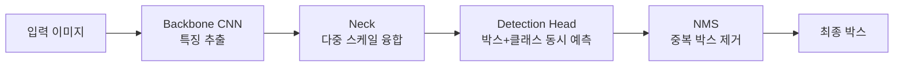

객체 탐지 — 사진 속에서 "어디에 뭐가 있는지" 박스로 찾아주는 그 기술 — 얘기를 한 번 정리하고 싶었다. 그중에서도 **YOLO(You Only Look Once)** 가 왜 이 분야의 사실상 기본값이 됐는지, 어떻게 굴러가는지를 내가 만져본 한에서 풀어보려고.

사실 객체 탐지라는 일 자체는 두 가지를 동시에 해야 한다. **무엇인지(classification)** 와 **어디 있는지(localization)**. 사람이라면 한 장 보면서 "왼쪽 위에 강아지, 가운데 자전거" 이렇게 자연스럽게 분리하지만, 모델 입장에선 한 픽셀씩 다 봐야 하는 일이다.

YOLO 이전의 R-CNN 계열은 이걸 **2단계**로 나눠서 풀었다. 일단 "여기 뭐 있을 것 같다" 싶은 후보 영역 수천 개를 뽑고, 그 각각을 다시 분류하는 식. 정확하긴 한데, 한 장에 수천 번 추론을 돌리니까 실시간은 꿈도 못 꿨다. 내가 학부 때 Faster R-CNN 돌려보면서 "이거 영상에 못 쓰는데?" 했던 기억이 있다.

YOLO 가 깬 가정은 단순했다. **이미지를 격자(grid)로 나누고, 각 칸이 자기 영역의 박스+클래스를 동시에 예측하게 한다.** 한 번의 forward pass 로 끝. 이름 그대로 "You Only Look Once".



여기서 좀 풀어보면, **Backbone** 은 그냥 사진에서 시각적 특징을 뽑아내는 CNN(요즘은 CSPDarknet, 혹은 v8 이후로는 더 가벼운 변형들). **Neck** 은 작은 객체와 큰 객체를 동시에 잘 잡으려고 여러 해상도의 특징맵을 섞어주는 부분(FPN, PAN 계열). **Head** 가 실제로 박스 좌표와 클래스를 뱉어내고. 마지막 **NMS(Non-Maximum Suppression)** 는 같은 강아지에 박스가 5개 겹쳐 나왔을 때 가장 자신 있는 하나만 남기고 지우는 후처리.


*[AI generated (Pollinations · Flux)](https://pollinations.ai/)*


재밌는 건, YOLO 가 한 번에 다 한다고 했을 때 사람들이 처음엔 "그럼 정확도 망하는 거 아냐?" 라고 의심했다. 근데 시간이 지나면서 v3, v5, v8, 그리고 최근 v10, v11 까지 오면서 정확도-속도 균형이 R-CNN 계열을 거의 다 따라잡거나 넘어섰다. 정확한 mAP 수치는 내가 외워서 적기 부담스러우니 생략하지만, 체감상 v8 부터는 "굳이 다른 거 쓸 이유가 없는데?" 수준.

내가 회사 사이드 프로젝트로 v8 을 RTX 4080 에서 돌려봤는데, 640x640 입력에 200fps 가까이 나왔다. 카메라 두세 대 동시에 처리해도 여유가 있는 정도. 학습은 ultralytics 패키지가 워낙 잘 싸놔서 진짜 한 줄이다:

```python
from ultralytics import YOLO
model = YOLO("yolov8n.pt")  # nano 모델
model.train(data="my_dataset.yaml", epochs=50, imgsz=640)
```

데이터셋 yaml 만 만들어두면 끝. 라벨링이 훨씬 더 오래 걸린다 — 이게 늘 진짜 병목이다.


*[AI generated (Pollinations · Flux)](https://pollinations.ai/)*


한계도 짚어야 공평하다. **작은 객체**, 특히 멀리 있는 자잘한 물체는 여전히 약하다. 격자 한 칸이 책임지는 영역이 너무 커서 정보가 뭉개진다. 그리고 **새로운 클래스**를 추가하려면 다시 학습해야 한다 — zero-shot 으로 임의의 단어를 박스로 잡아주는 건 OWL-ViT, Grounding DINO 같은 vision-language 계열의 영역이고, YOLO 의 강점(속도)과는 결이 다르다. 요즘은 이 둘을 어떻게 합치느냐가 또 다른 흐름인데, 거기까진 다른 글에서.

체감으로 말하면, 객체 탐지가 필요한 거의 모든 production 상황의 **첫 후보**는 여전히 YOLO 다. 일단 빠르고, 학습 파이프라인이 너무 잘 닦여 있고, 모델 크기 옵션(n/s/m/l/x)이 GPU 사정에 맞춰 고를 수 있게 돼 있어서. 더 정확한 게 필요하면 그때 가서 DETR 계열을 본다, 정도의 순서.

이게 v12, v13 가서는 또 어떻게 변할지는 좀 더 봐야 할 것 같다.