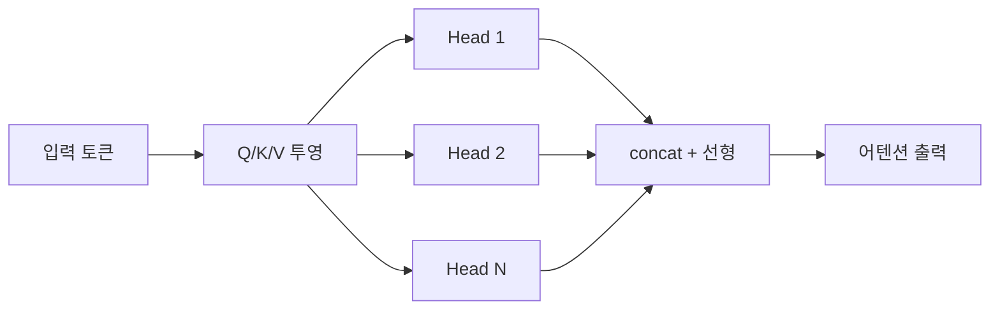

어텐션 메커니즘 — Transformer 의 심장이라 부르는 그것 — 을 한 번 제대로 정리해 두고 싶었어. 사실은 일하면서 LLM 을 붙이고 튜닝하다 보면 어텐션을 "그냥 잘 굴러가는 검은 상자" 로 두게 되거든. 근데 가끔 컨텍스트 길이 늘리거나 KV cache 만지다 보면, 결국 어텐션을 모르면 다음 한 발이 안 나가더라.

비유부터 하나. 어텐션은 회의실에서 누가 말할 때 **다른 사람들이 그 말에 얼마나 귀를 기울일지 가중치를 매기는 작업** 이라고 보면 얼추 맞아. 누가 "프로젝트 일정" 이라고 던지면, 그 자리에 있는 PM 의 발언에는 0.6 만큼, 디자이너 발언엔 0.05 만큼 집중하는 식. 모델 입장에서 토큰 하나하나가 회의실의 참석자고, 어텐션은 매 발화 시점마다 "이 단어를 이해하려면 누구 말을 얼마나 들어야 하나" 를 새로 계산하는 거지.

좀 더 안으로 들어가면 핵심은 세 개의 벡터 — Q (Query), K (Key), V (Value). 회의 비유로 다시 풀면 Q 는 지금 내가 던지는 질문, K 는 참석자들이 들고 있는 명찰, V 는 그 사람이 실제로 들고 있는 정보. Q 와 K 의 내적(dot product) 으로 "이 명찰이 내 질문에 얼마나 들어맞나" 를 점수 내고, softmax 로 비율화한 다음 V 를 가중합. 그게 한 번의 어텐션 출력이지.


*[AI generated (Pollinations · Flux)](https://pollinations.ai/)*


수식으로 보면 (Vaswani et al., 2017) 의 그 유명한 한 줄:

```python
import torch
import torch.nn.functional as F

def attention(Q, K, V):
    d_k = Q.size(-1)
    scores = (Q @ K.transpose(-2, -1)) / (d_k ** 0.5)
    weights = F.softmax(scores, dim=-1)
    return weights @ V
```

`sqrt(d_k)` 로 나누는 건, 차원이 커질수록 내적 값이 폭발해서 softmax 가 한 점에 몰리는 걸 막으려는 장치. 처음 봤을 땐 "왜 하필 루트?" 싶었는데, 내적이 분산 d_k 정도로 커진다는 걸 떠올리면 자연스러워지긴 해.

진짜 재밌는 건 여기서부터. 어텐션이 Q·K·V 한 세트로만 돌면 시야가 좁아지니까, **Multi-Head Attention** 으로 여러 세트를 병렬로 굴려. 한 헤드는 문법 관계를 보고, 다른 헤드는 멀리 떨어진 지시 관계를 보고… 같은 식으로 헤드마다 다른 시점을 학습한다고 해석되지. 학습이 끝난 뒤 어텐션 맵을 그려보면 헤드별로 정말 다른 패턴이 떠오르는 게 보여 — 솔직히 이 부분은 매번 봐도 신기해.




*[AI generated (Pollinations · Flux)](https://pollinations.ai/)*


근데 이게 production 에선 좀 골치 아픈 부분이 있어. 어텐션은 입력 길이 N 에 대해 **N² 의 메모리·연산** 을 먹는단 점. 컨텍스트 길이 8k 까지는 무난한데 32k, 100k 로 가면 KV cache 만 GB 단위로 부풀어. 그래서 요즘은 FlashAttention 으로 메모리 액세스 패턴을 바꾸거나, sliding window·multi-query·grouped-query 같은 변형으로 비용을 줄이는 게 거의 표준이 됐고. 내가 vLLM 으로 7B 모델 서빙해본 한에선, GQA 쓰는 모델이 동일 컨텍스트에서 메모리를 눈에 띄게 덜 먹더라 (정확한 절감률은 모델 구성에 따라 다르니 단정은 못 하겠어).

여기까지 정리하면서도 한 가지 잊지 말아야 할 건, 어텐션이 "왜 거기에 집중했는지" 를 우리가 완전히 설명하지는 못한다는 점. 어텐션 가중치를 모델의 해석 근거로 쓰는 연구들이 한때 유행했는데, 그게 그렇게 직관적이지 않다는 반론도 만만치 않게 쌓였지 (Jain & Wallace, 2019 같은 작업이 대표적). 어텐션 맵이 예쁘게 떨어진다고 해서 그게 곧 모델의 "추론" 이라고 단정하긴 어렵다는 얘기.

그래서 어텐션은, 적어도 내가 보기엔, 잘 굴러가는 검은 상자에서 **반쯤 투명한 상자** 가 된 정도. 구조는 또렷한데 내부 해석은 여전히 진행 중. 이게 어떻게 더 풀려갈진 좀 더 봐야 할 것 같아.