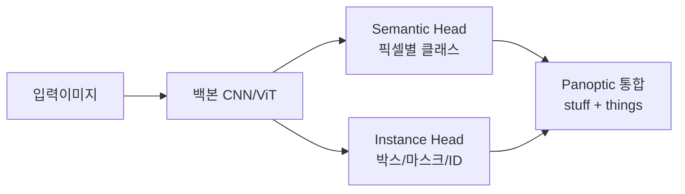

세그멘테이션(segmentation) — 이미지 안의 어디까지가 무엇인지 픽셀 단위로 잘라내는 작업 — 을 처음 공부할 때 가장 헷갈렸던 게 종류가 세 개로 갈린다는 부분이었다. semantic, instance, panoptic. 셋 다 "픽셀에 라벨 붙이는 일" 이라는 점은 같은데, 그 라벨이 뭐를 의미하느냐가 다르다.

비유를 하나 들면 이렇다. 길거리 사진 한 장이 있다고 치자. 사람 셋, 자동차 둘, 도로, 하늘.

- **Semantic** 은 "이 픽셀은 사람" / "이 픽셀은 자동차" / "이 픽셀은 도로" 까지만 표시한다. 사람 셋이 다 같은 '사람' 색으로 칠해진다. 두 명이 옆에 붙어 있으면 그냥 한 덩어리.
- **Instance** 는 "이건 사람1, 이건 사람2, 이건 사람3" 으로 셋을 구분해 색을 다르게 칠한다. 대신 보통 도로·하늘 같은 셀 수 없는 배경(stuff) 은 신경 안 쓴다.
- **Panoptic** 은 둘을 합친다. 사람은 1/2/3 으로 나누고, 도로·하늘은 한 덩어리로. "셀 수 있는 것(things)" 과 "셀 수 없는 것(stuff)" 을 동시에.

*[AI generated (Pollinations · Flux)](https://pollinations.ai/)*

내가 처음 이걸 굴려본 건 자율주행 데이터셋(Cityscapes 였던 걸로 기억한다) 으로 토이 프로젝트 돌렸을 때였는데, 그때 든 첫 인상이 "아 이거 그냥 분류기인데 픽셀마다 돌리는 거잖아?" 였다. 절반은 맞고 절반은 틀린 직관이다.

맞는 부분: 결국 출력은 픽셀 × 클래스 score 맵. semantic 의 경우엔 정말 픽셀별 분류기에 가깝다.

틀린 부분: instance 부터는 "각 사람마다 다른 ID 를 부여" 해야 하니까 단순 분류만으론 안 된다. detection(박스 찾기) + mask 예측을 같이 돌리는 Mask R-CNN 계열이 오래된 표준이었고, 요즘은 query 기반(Mask2Former, MaskFormer)으로 처리하는 게 일반적인 것 같더라.

요즘 흐름은 위 세 가지를 따로따로 모델로 풀던 시절을 지나, **하나의 query 기반 트랜스포머가 셋 다 처리**하는 방향으로 통합되는 분위기다. Mask2Former 가 그 대표 격이고, 내가 본 한에서는 같은 아키텍처로 task 만 바꿔 돌릴 수 있다는 게 꽤 인상적이었다.

*[AI generated (Pollinations · Flux)](https://pollinations.ai/)*

근데 솔직히 production 관점에선 셋 중 뭐가 필요한지가 먼저다. 의료 영상에서 종양 영역만 잡고 싶다? semantic 으로 충분한 경우가 많다. 매장 안 사람 수를 세고 동선을 추적해야 한다? instance 가 필요하다. 자율주행에서 도로 영역 + 보행자 각각 + 차량 각각을 한 번에? panoptic.

체감상 가장 골치 아픈 건 instance 다. semantic 은 IoU 같은 평가지표가 깔끔하고 학습도 비교적 안정적인 반면, instance 는 "사람 한 명을 두 개로 쪼개버리는 over-segmentation" 같은 실수가 잦아서 후처리 튜닝을 꽤 만져야 했다. panoptic 은 instance 의 어려움에 stuff 까지 얹은 셈이라 더 까다롭지만, 평가지표(PQ — panoptic quality)가 things/stuff 를 균형 있게 보도록 설계돼 있어서 모델끼리 비교는 오히려 명확한 편이다.

이게 정답 결론은 아니고, 새로 시작하는 사람이라면 일단 **semantic 부터 손으로 한 번 돌려보는 게 직관이 잡힌다**. 거기서부터 instance, panoptic 으로 올라가면 왜 점점 어려워지는지가 자연스럽게 느껴지더라.