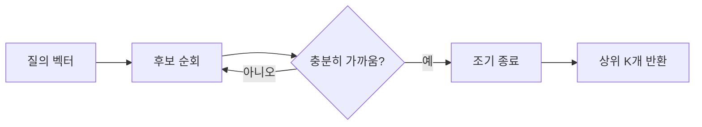

요즘 개발자 커뮤니티 타임라인을 보면 검색과 머신러닝 구현 이야기가 한꺼번에 올라오는 날이 있다. 어제가 딱 그랬다. 파이썬으로 짜는 최소 퍼셉트론, Manticore Search의 KNN 조기 종료, 심볼 연산 라이브러리 Symbolica 2.0, 그리고 구글이 검색 품질 평가를 사용자한테 떠넘긴다는 비판 글까지. 서로 상관없어 보이는데, 가만 보면 다 "검색이든 AI든, 안에서 뭐가 어떻게 돌아가는가"에 대한 관심이더라.

제일 먼저 눈에 들어온 건 퍼셉트론 글이었다. 퍼셉트론은 1950년대에 나온, 신경망의 가장 원시적인 형태다. 입력 몇 개에 가중치를 곱해서 더하고, 어떤 선을 넘으면 1, 못 넘으면 0을 뱉는 게 전부. 요즘 GPT니 뭐니 하는 거대한 모델들도 결국 이 단순한 단위를 수십억 개 쌓아 올린 거라, "가장 작은 뇌"라는 제목이 좀 와닿았다. 사실 나도 입사 초에 이걸 numpy 없이 순수 파이썬으로 한 번 짜봤는데, AND 게이트 하나 학습시키는 데도 가중치가 어떻게 움직이는지 눈으로 보이니까 추상적이던 게 갑자기 손에 잡히더라.

```python
def perceptron(x, w, b):
    s = sum(xi * wi for xi, wi in zip(x, w))
    return 1 if s + b > 0 else 0
```

이게 정말 끝이다. 여기에 "틀리면 가중치를 정답 방향으로 조금 민다"는 규칙 하나만 더 붙이면 학습이 된다.


*[Photo by Nick Morrison on Unsplash](https://unsplash.com/@nickmorrison?utm_source=blogmaker&utm_medium=referral)*


Manticore Search의 KNN 조기 종료는 결이 좀 다른, 실무에 가까운 이야기다. KNN(K-Nearest Neighbors)은 어떤 벡터가 들어왔을 때 "가장 비슷한 이웃 K개"를 찾는 건데, RAG든 추천이든 벡터 검색의 핵심이 결국 이거다. 문제는 데이터가 수백만 건이면 전부 비교하는 게 너무 느리다는 것. 그래서 "이미 충분히 가까운 후보를 찾았으면 나머지는 안 본다"는 식으로 중간에 끊는 게 조기 종료다.



체감상 이런 최적화가 production에서 진짜 차이를 만든다. 정확도를 아주 살짝 양보하고 지연 시간을 확 줄이는 거래인데, 1000명이 동시에 검색을 때릴 때 이 "살짝"이 서버가 죽냐 사냐를 가른다. 정확한 수치는 케이스마다 다르니 함부로 말 못 하겠지만.

Symbolica 2.0은 솔직히 나도 깊게는 모른다. 파이썬·러스트용 프로그래머블 심볼 라이브러리라는데, 수식을 숫자로 근사하지 않고 기호 그대로 다루는 쪽(이른바 symbolic computation)으로 보인다. 머신러닝이 죄다 근사·확률로 가는 시대에, 정확한 대수 연산을 빠르게 하겠다는 방향이라 좀 반갑긴 했다. 이게 ML 워크플로에 실제로 어떻게 끼어들지는 더 봐야 할 것 같다.


*[Photo by Ilham Malik on Unsplash](https://unsplash.com/@ilhamalic?utm_source=blogmaker&utm_medium=referral)*


근데 제일 곱씹게 된 건 구글 글이었다. 요지는, 검색 결과에 점점 끼어드는 AI 요약과 추천을 우리가 보고 클릭하고 넘기는 그 행동 자체가 사실상 품질 평가 데이터가 된다는 거다. 원래 구글은 검색 품질 평가자(quality rater)를 돈 주고 고용해 왔는데, 이제 그 일을 이용자가 무보수로 대신하고 있다는 비판.

> Google just made you a search quality rater. You won't get paid.

이게 좀 웃긴 게, 위 세 기술 글이 "안이 어떻게 돌아가는지"를 까보려는 호기심이라면, 구글 이야기는 "정작 우리가 매일 쓰는 검색의 안은 점점 안 보인다"는 거니까. 같은 날 같은 피드에 올라온 게 우연만은 아닌 것 같았다. 퍼셉트론은 12줄로 까볼 수 있는데, 내 클릭이 어디로 흘러가 뭘 학습시키는지는 도무지 못 까본다. 이 비대칭이 앞으로 어떻게 벌어질지, 나는 좀 더 지켜보려 한다.

***

**참고**

- [The Smallest Brain You Can Build: A Perceptron in Python](https://ranpara.net/posts/perceptron-explained-from-scratch/)
- [KNN early termination in Manticore Search](https://manticoresearch.com/blog/knn-early-termination/)
- [Symbolica 2.0: Programmable Symbols for Python and Rust](https://symbolica.io/posts/symbolica_2_0_release/)
- [Google just made you a search quality rater. You won't get paid](https://mojodojo.io/blog/google-just-made-you-a-search-quality-rater-you-won-t-get-paid)