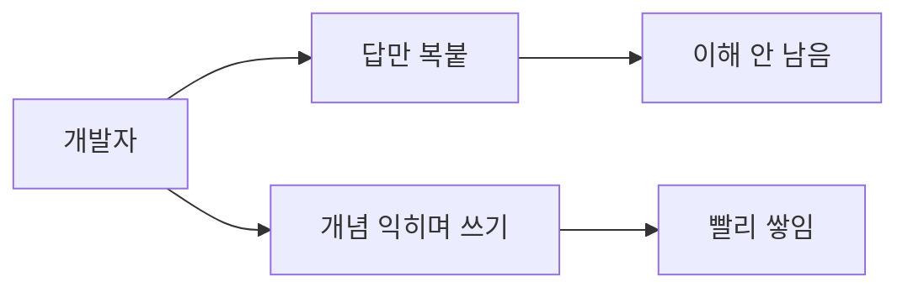

요즘 해커뉴스를 보면 LLM — 그러니까 ChatGPT나 Claude처럼 사람 말로 코드까지 짜주는 그 큰 언어모델 — 이 소프트웨어 엔지니어 일을 어디까지 잠식하는가 하는 글이 며칠 새 줄줄이 올라온다. 그중 제목 하나가 좀 아팠다. "LLM이 내 개발 커리어를 갉아먹는데 어떻게 해야 할지 모르겠다." 댓글이 몇백 개 달렸더라. 남 얘기 같지가 않아서 나도 한참 스크롤했다.

솔직히 나도 비슷한 걸 체감한다. 예전엔 모르는 API 만나면 문서 뒤지고, 깃허브 이슈 파고, 그 과정에서 머릿속에 지도가 그려졌다. 근데 요즘은 그냥 모델한테 물어보면 30초 만에 동작하는 코드가 나온다. 일은 빨라졌는데, 1년 지나고 보니 내가 그 영역을 진짜로 "아는" 느낌은 옅어졌더라. 답은 손에 있는데 이해는 안 남는 거다.

재밌는 건, 같은 날 올라온 다른 글이 정확히 그 불안에 대한 대답 같았다는 거다. Lathe라는 작은 도구인데, 슬로건이 "LLM으로 새 분야를 건너뛰지 말고 익혀라"였다. 모델한테 정답을 받아 베끼는 게 아니라, 모델을 일종의 개인 교사로 세워서 개념을 차근차근 떠먹는 방식. 같은 LLM인데 쓰는 사람 태도에 따라 지식을 빼앗기기도 하고 더 빨리 쌓기도 한다는 게 좀 묘했다.

그리고 또 하나, 'Tokenomics'라는 글. 에이전트가 코딩 작업을 할 때 토큰을 — 토큰은 모델이 글자를 잘게 쪼개 세는 단위, 곧 비용이자 속도다 — 대체 어디서 그렇게 많이 쓰는지 정량 분석한 내용이다. 내가 막연히 "에이전트 한 번 돌리면 비싸더라" 했던 걸 숫자로 까 보여준 셈. 정확한 수치는 글에서 직접 확인해야겠지만, 결국 모델한테 일을 떠넘길수록 어디서 새는지 모르면 돈만 빠진다는 얘기로 읽혔다.

*[Photo by Coinhako on Unsplash](https://unsplash.com/@coinhako_official?utm_source=blogmaker&utm_medium=referral)*

세 글을 묶어 보면 그림이 단순해진다. 도구를 어떻게 쥐느냐의 문제로 흐름이 갈린다.

내가 내린 결론은 아직 없다. 다만 모델을 답 자판기로 쓰면 커리어가 깎이고, 교사 겸 동료로 쓰면 오히려 가속된다 — 정도의 가설은 생겼다. 어느 쪽이 맞는지는 한두 해 더 굴려봐야 알 것 같다. 일단 나는 다음 모르는 분야 하나를, 답을 받지 않고 물어가며 배워볼 생각이다.

***

**참고**

- [Teenage Engineering: Introducing APC-2](https://teenage.engineering/products/apc-2)
- [Building from zero after addiction, prison, and a felony](https://gavinray97.github.io/blog/building-from-zero-after-addiction-prison-felony)
- [Show HN: Lathe – Use LLMs to learn a new domain, not skip past it](https://github.com/devenjarvis/lathe)
- [LLMs are eroding my software engineering career and I don't know what to do](https://human-in-the-loop.bearblog.dev/llms-are-eroding-my-software-engineering-career-and-i-dont-know-what-to-do/)
- [Tokenomics: Quantifying Where Tokens Are Used in Agentic Software Engineering](https://arxiv.org/abs/2601.14470)