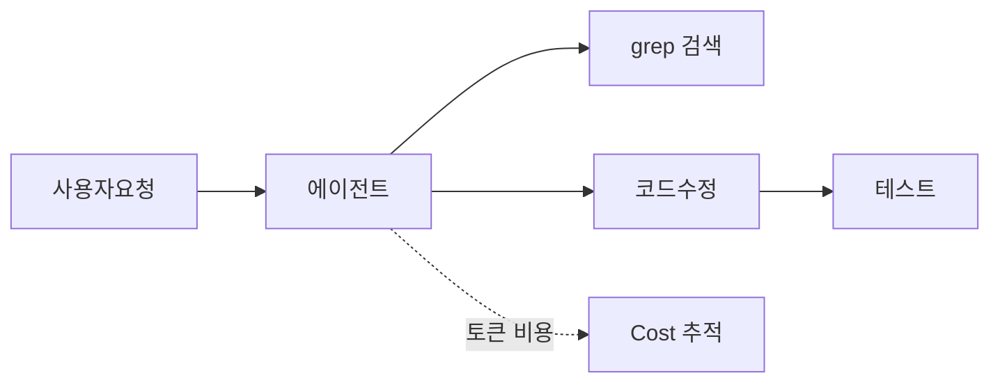

해커뉴스 AI 섹션을 훑다가, 코딩 에이전트 관련 글 세 개가 같은 날 위로 올라온 걸 봤다. 묘하게 결이 비슷하더라. 모델이 얼마나 똑똑한지, GPT 다음이 뭔지 — 그런 얘기가 아니라 죄다 "이놈을 실제로 굴릴 때 뭐가 문제냐" 쪽이었거든.

여기서 에이전트라는 건, 사람이 한 줄 한 줄 시키는 게 아니라 "이 버그 고쳐줘" 하면 알아서 파일 뒤지고 코드 고치고 테스트 돌리는 AI를 말한다. 요즘 코딩 도구들이 다 이 방향으로 가는 중이고.

첫 번째가 Grit. Rust로 Git을 통째로 다시 짜는 프로젝트인데, 사람이 아니라 에이전트한테 시켜서 만든다는 게 포인트다. Git 재구현이야 예전부터 있던 취미 프로젝트지만, "에이전트가 이 정도 규모 코드를 끌고 갈 수 있나"를 보는 실험에 가깝게 느껴졌다.


*[Photo by Ansuman Mishra on Unsplash](https://unsplash.com/@minutesby?utm_source=blogmaker&utm_medium=referral)*


두 번째 글 제목이 좀 웃겼다. "Is Grep All You Need?" — 에이전트가 코드베이스에서 답을 찾을 때, 거창한 벡터 검색이니 임베딩이니 다 필요 없고 그냥 `grep` 하나면 충분한 거 아니냐는 도발. 솔직히 내 경험상으로도 절반은 맞는 말 같다. 에이전트한테 멋진 검색 인프라를 깔아줘봐야, 정작 잘 도는 건 단순 텍스트 검색을 반복해서 좁혀가는 방식이더라. 검색 품질보다 그걸 감싸는 harness — 그러니까 에이전트가 도구를 어떤 순서로, 몇 번 부르게 짜놨느냐 — 가 결과를 더 많이 가른다는 얘기.

```bash
grep -rn "TODO" src/
```

세 번째는 Cost.dev라는 YC 스타트업. 에이전트 호출 비용을 인식시키고 줄여준다는 건데, 이게 왜 나왔는지는 한 번이라도 에이전트를 길게 돌려본 사람이면 바로 안다. 토큰이 무섭게 녹거든. 파일 하나 고치는데 모델이 컨텍스트를 수십 번 다시 읽으면, 커피 한 잔 값이 우습게 나간다. 비용을 눈에 보이게 만들어 주는 도구가 장사가 된다는 것 자체가, 이 시장이 데모 단계를 지나 운영 단계로 넘어왔다는 신호 같고.



세 글을 묶어 보면, 관심사가 "얼마나 똑똑하냐"에서 "도구·검색·비용을 어떻게 다루냐"로 옮겨가는 게 보인다. 모델 자랑은 한물 가고, 이제 살림살이 얘기가 시작된 셈. 내 환경에서도 에이전트를 붙여 쓸수록 결국 발목 잡는 건 모델 지능이 아니라 이 운영 디테일들이더라. 이 흐름이 어디까지 굳어질진 조금 더 지켜봐야 할 것 같다.

***

**참고**

- [Grit: Rewriting Git in Rust with agents](https://blog.gitbutler.com/true-grit)
- [Is Grep All You Need? How Agent Harnesses Reshape Agentic Search](https://arxiv.org/abs/2605.15184)
- [Show HN: Cost.dev (YC W21) – making agents cost-aware and cheaper to call](https://cost.dev/)