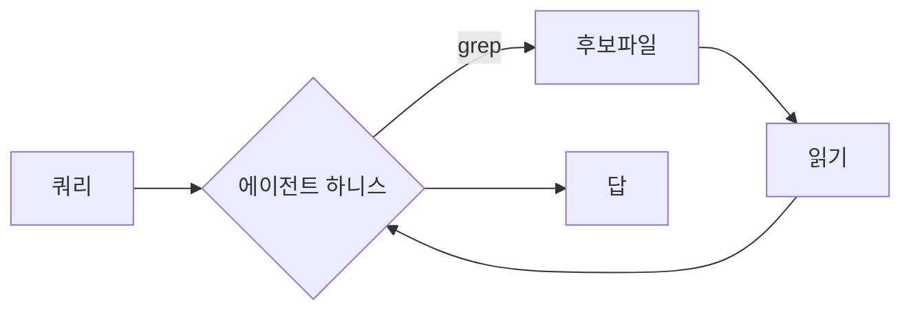

HN 상위에 코딩 에이전트를 떠받치는 기반 도구들이 한꺼번에 올라온 걸 보고, 흐름이 한 칸 옮겨갔구나 싶었다. 에이전트 자체—사람 대신 코드를 짜고 고치는 AI 프로그램—가 신기하던 단계는 지난 모양이지. 이제 사람들 관심은 "그 에이전트가 일을 잘하게 떠받치는 바닥"으로 내려가고 있더라.

같은 날 눈에 띈 게 세 개였다. Rust로 Git을 다시 쓴다는 Grit, "에이전트 검색엔 grep만 있으면 되는 거 아니냐"를 따져보는 분석 글, 그리고 에이전트 API 호출 비용을 깎아준다는 Cost.dev(YC W21). 주제가 제각각인 것 같은데, 가만 보면 한 줄기다. 버전관리, 코드 탐색, 비용—에이전트가 실제로 굴러갈 때 발목 잡는 세 군데를 각자 건드리고 있거든.

먼저 Grit. Git을 Rust로 다시 쓴다는 건데, 솔직히 "또 Rust 재작성이냐" 싶은 피로감이 먼저 왔다. 근데 맥락이 좀 다르더라. 사람이 git commit 치는 빈도랑, 에이전트가 자동으로 수십 번 브랜치 따고 되돌리고 diff 떠보는 빈도는 자릿수가 다르다. 에이전트는 한 작업 안에서 git을 미친 듯이 두들기거든. 그러니 호출당 오버헤드랑 라이브러리로 깔끔하게 박히는 임베더빌리티가 갑자기 중요해지는 거지. Git이 느려서 못 쓰겠다는 사람은 거의 없었는데, "에이전트가 쓰기 좋은 git"이라는 새 기준이 생긴 셈이랄까.

*[Photo by Tima Miroshnichenko on Pexels](https://www.pexels.com/@tima-miroshnichenko)*

두 번째 글이 개인적으론 제일 재밌었다. "Is Grep All You Need?"—에이전트가 코드베이스를 뒤질 때 결국 grep(파일 안 텍스트를 패턴으로 찾는 그 오래된 명령어) 정도면 충분한가, 아니면 임베딩 기반 시맨틱 검색 같은 무거운 장치가 필요한가를 따지는 내용이다. 내 체감으론, 요즘 잘 만든 코딩 에이전트들이 의외로 grep이랑 파일 트리 훑기로 꽤 멀리 가더라. 사람이 모르는 코드 처음 받았을 때 하는 짓이랑 똑같지. 일단 키워드로 긁어보고, 나온 파일 몇 개 열어 읽고, 거기서 다음 단서 잡고.

재밌는 건, 검색 품질이 검색 알고리즘보다 "에이전트 하니스"—그러니까 에이전트가 도구를 어떤 순서로 쓰고 결과를 어떻게 다시 읽느냐, 그 바깥 골격—에 더 좌우된다는 관점이었다. 도구는 단순한 grep인데, 그걸 여러 번 똑똑하게 엮는 루프가 진짜 검색기 노릇을 한다는 거. 무거운 벡터 인덱스 깔기 전에 이 골격부터 점검하는 게 맞겠다 싶었다.

이게 왜 내 생활에 닿느냐면—나처럼 LLM을 제품에 붙여 운영하는 입장에선, 시맨틱 검색 인프라 하나 까는 데 드는 돈과 운영 부담이 만만치 않거든. 근데 grep 루프로 충분한 영역이 생각보다 넓다면, 안 깔아도 되는 걸 안 까는 게 제일 남는 장사지.

세 번째 Cost.dev로 자연스럽게 넘어간다. 에이전트를 한 번 굴리면 모델 API를 한두 번 부르고 끝나는 게 아니다. 도구 쓰고 결과 받고 다시 생각하고를 반복하면서 한 작업에 호출이 수십 번씩 쌓인다. 토큰은 야금야금 빠지는데 청구서는 월말에 한 방으로 온다. Cost.dev는 이걸 "에이전트가 자기 호출 비용을 인지하게(cost-aware) 만들고 더 싸게 부르게" 해준다는 쪽이더라. 정확한 절감 수치는 직접 안 돌려봐서 말 못 하겠고, 방향만 보면—모델 라우팅(쉬운 건 싼 모델로, 어려운 것만 비싼 모델로)이나 캐싱 같은 흔한 레버를 한곳에서 관리해주는 류로 짐작한다. 내가 잘못 짚었을 수도 있다.

*[Photo by Kindel Media on Pexels](https://www.pexels.com/@kindelmedia)*

세 개를 묶어 보면 결론이 닫히기보단 질문이 하나 남는다. 에이전트 시대의 인프라가 사람 시대의 인프라랑 다른 모양으로 다시 깎이고 있다는 거. git도, 검색도, 비용 관리도—"사람이 가끔 쓴다"가 아니라 "에이전트가 루프 안에서 폭발적으로 쓴다"를 전제로 다시 설계되는 중이지. 호출당 오버헤드, 임베더빌리티, 자기 비용 인지 같은 단어가 갑자기 1급 시민이 된 것도 그래서고.

다만 이게 진짜 새 카테고리로 굳을지, 아니면 기존 도구들이 에이전트 친화 기능 몇 개 붙이고 흡수해버릴지는 아직 모르겠다. Grit이 git을 밀어낼 거란 생각은 안 든다—그래도 "에이전트가 쓰기 좋은가"라는 질문 자체는 한동안 안 사라질 것 같네. 한 분기쯤 더 지켜보면 윤곽이 잡히지 않을까 싶다.

***

**참고**

- [Grit: Rewriting Git in Rust with agents](https://blog.gitbutler.com/true-grit)
- [Is Grep All You Need? How Agent Harnesses Reshape Agentic Search](https://arxiv.org/abs/2605.15184)
- [Show HN: Cost.dev (YC W21) – making agents cost-aware and cheaper to call](https://cost.dev/)