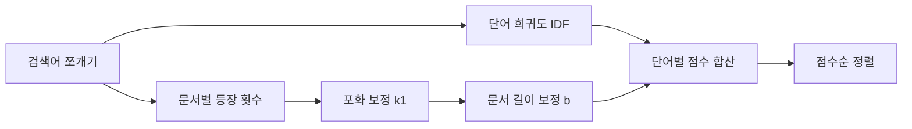

검색이라는 게 결국 "이 질문이랑 제일 비슷한 문서 찾아줘" 인데, RAG — 요즘 LLM 에 회사 문서나 매뉴얼을 물려서 답하게 만드는 그 구조 — 를 만들다 보면 제일 먼저 부딪히는 게 BM25라는 이름이거든. 임베딩이니 벡터 검색이니 화려한 얘기 다 빼고, 솔직히 현장에서 제일 먼저 깔고 시작하는 검색기가 이놈인 경우가 많더라.

BM25가 뭐냐. 풀네임이 Best Matching 25인데, 이름에 25가 붙은 건 그냥 논문 실험에서 25번째로 정리된 변형이라 그런 거고 깊은 뜻은 없지. 한 줄로 말하면 "단어가 문서에 몇 번 나왔나" 를 똑똑하게 세는 점수 계산법이야. 1994년쯤 나온 꽤 늙은 기법인데 아직도 안 죽고 살아있는 게 재밌는 부분.

핵심 직관부터 잡고 가자. 옛날 방식은 단순했어. "파이썬" 이라는 단어가 A 문서에 10번, B 문서에 2번 나오면 A 가 더 관련 있다고 본 거지. 근데 여기엔 두 가지 함정이 있어.

첫째, 흔한 단어 문제. "그리고", "the", "은/는" 같은 단어는 아무 문서에나 수십 번 나오잖아. 이런 건 많이 나와도 점수를 주면 안 되는 거고. 그래서 BM25는 **희귀한 단어일수록 가중치를 키워**. 전체 문서 중에 이 단어를 가진 문서가 적을수록 "아 이건 특별한 신호다" 하고 점수를 올려주는 거지. 이걸 IDF(역문서빈도)라고 부르는데, 직관적으로는 "흔하면 깎고 희귀하면 키운다" 한 문장이면 끝.

둘째, 횟수가 무한정 점수가 되면 안 된다는 거. "파이썬" 이 100번 나온 문서가 10번 나온 문서보다 10배 관련 있냐? 아니거든. 두 번째 등장부터는 정보가 별로 안 늘어. BM25는 여기서 등장 횟수를 **포화(saturation)** 시켜. 처음 몇 번은 점수가 쭉 오르다가, 어느 순간부터는 아무리 더 나와도 점수가 거의 안 올라가게 천장을 둔 거야.


*[Photo by Isaac Smith on Unsplash](https://unsplash.com/@isaacmsmith?utm_source=blogmaker&utm_medium=referral)*


여기에 하나 더. 문서 길이 보정. 긴 문서는 그냥 단어 수가 많으니 우연히 검색어가 더 자주 들어가기 마련이지. 블로그 한 편이랑 책 한 권을 같은 기준으로 비교하면 책이 무조건 이겨버려. 그래서 BM25는 평균 문서 길이로 나눠주는 보정을 넣어서, 짧은 문서가 억울하게 지지 않게 만들어. 이 보정의 세기를 조절하는 게 `b` 라는 파라미터고.

흐름을 그림으로 보면 이렇게 굴러가:



파라미터는 사실 둘만 알면 돼. `k1` 은 아까 말한 포화 곡선의 가파름 — 보통 1.2~2.0 사이를 쓰고, `b` 는 길이 보정 세기 — 0이면 길이 무시, 1이면 완전 보정, 관례적으로 0.75. 내가 손대본 한에서는 이 기본값을 굳이 안 건드려도 웬만하면 잘 나오더라. 튜닝하겠다고 덤비기 전에 기본값으로 한 번 돌려보는 걸 권하는 편.

코드로는 정말 별거 없어. 파이썬이면 `rank_bm25` 라이브러리로 몇 줄이면 끝나거든.

```python
from rank_bm25 import BM25Okapi

corpus = [doc.split() for doc in documents]  # 단어 단위로 쪼갬
bm25 = BM25Okapi(corpus)                      # 색인 구축
scores = bm25.get_scores("파이썬 비동기".split())
```

다만 한국어는 `split()` 으로 띄어쓰기만 쪼개면 "검색이", "검색을", "검색은" 이 전부 다른 단어로 잡혀서 점수가 흩어져. 그래서 형태소 분석기(konlpy 같은)로 어간을 뽑아주는 전처리가 거의 필수인데, 이 부분에서 품질이 꽤 갈리는 것 같아. 영어 예제만 보고 따라 했다가 "왜 검색이 이상하지" 하는 경우 대부분 여기.


*[Photo by Joshua Aragon on Unsplash](https://unsplash.com/@goshua13?utm_source=blogmaker&utm_medium=referral)*


그럼 임베딩 시대에 왜 아직 이걸 쓰냐. 체감상 두 가지야. 하나는 **정확한 단어 매칭**에 강하다는 점. 제품 코드명이나 에러 코드, 사람 이름처럼 "글자 그대로" 가 중요한 검색에서는 의미 벡터보다 BM25가 훨씬 안 틀려. 벡터 검색은 "비슷한 의미" 를 잘 찾는 대신 정확히 그 단어를 놓치는 일이 종종 있거든. 다른 하나는 가볍다는 거. GPU 없이 노트북에서도 수만 건 색인이 순식간이라, 프로토타입 첫 삽으로 이만한 게 없지.

그래서 요즘 RAG 는 둘을 섞는 **하이브리드** 가 거의 표준처럼 자리잡는 분위기야. BM25로 글자 매칭 잡고, 벡터로 의미 매칭 잡고, 둘 점수를 합치는 식(RRF 같은 방법으로). 어느 쪽도 혼자서는 완벽하지 않으니까.

늙은 기법이라고 무시하고 넘어갔다가, 결국 한 바퀴 돌아 다시 깔게 되는 게 BM25인 듯. 처음 RAG 만질 거면 화려한 벡터 DB 붙이기 전에 이걸로 베이스라인 한 번 잡아보길. 의외로 "이 정도면 되는데?" 싶은 순간이 꽤 자주 오니까.