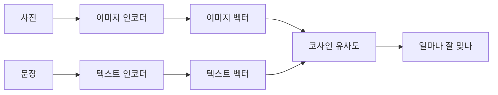

CLIP 이라는 모델 — 사진과 문장을 한 공간에 같이 욱여넣는 그 물건 — 을 처음 제대로 들여다본 건 작년에 사내 이미지 검색 기능을 붙이면서였다. "강아지 사진 찾아줘"를 태그 없이 처리해야 하는데, 정답이 결국 CLIP 이더라. OpenAI 가 2021년에 내놓은 모델인데(Radford et al., 2021), 이름은 Contrastive Language-Image Pre-training 의 약자다. 풀어 쓰면 "대조 학습으로 언어랑 이미지를 같이 사전학습했다" 정도.

근데 이게 왜 신기하냐면, 보통 이미지 분류 모델은 "이건 고양이, 이건 개" 하고 정해진 라벨 목록 안에서만 답한다. 1000개 카테고리로 학습했으면 1001번째는 못 맞춘다. CLIP 은 그 틀을 깬다. 사진을 주고 "이건 무슨 사진?"이 아니라, **아무 문장이나 던져서 "이 사진이랑 이 문장이 얼마나 잘 맞아?"** 를 점수로 매긴다.

비유하자면 이렇다. 사진을 읽는 사람(이미지 인코더)과 글을 읽는 사람(텍스트 인코더)이 따로 있는데, 둘이 같은 언어로 메모를 적게 훈련시킨 거다. 사진 담당이 강아지 사진을 보고 "[0.2, -1.3, 0.8, ...]" 이런 숫자 벡터를 적으면, 글 담당이 "a photo of a dog"를 읽고 적은 벡터가 거의 똑같은 자리에 찍히도록. 반대로 "a photo of a car"는 멀찍이 떨어지게.


*[Photo by Ilo Frey on Pexels](https://www.pexels.com/@couleur)*


훈련 방식이 핵심인데 — 이게 좀 단순해서 오히려 놀랐다. 인터넷에서 긁어모은 (이미지, 캡션) 쌍 4억 개를 쓴다. 한 배치에 사진 N장, 문장 N개가 들어오면 정답 짝은 N개고 나머지 N²−N 개는 다 오답이다. 정답 짝의 벡터는 끌어당기고, 오답 짝은 밀어낸다. 그게 "대조(contrastive)" 학습이라는 이름의 정체다.



실제로 쓸 때 제일 와닿는 게 zero-shot 분류다. 사진 한 장을 분류하고 싶은데 따로 학습을 안 시켜도 된다. 분류 후보를 그냥 문장으로 적어서 비교하면 끝.

```python
import torch, clip
from PIL import Image

model, preprocess = clip.load("ViT-B/32")
image = preprocess(Image.open("mystery.jpg")).unsqueeze(0)
labels = ["a photo of a cat", "a photo of a dog", "a photo of a car"]
text = clip.tokenize(labels)

with torch.no_grad():
    logits, _ = model(image, text)
    probs = logits.softmax(dim=-1)  # 각 라벨이 맞을 확률
print(probs)
```

후보 목록을 코드에서 바꾸기만 하면 분류 대상이 바뀐다. 모델은 그대로 두고. 처음 이걸 돌려봤을 때 좀 허무하면서도 똑똑하다 싶더라. "a photo of a {라벨}" 이라는 틀에 단어만 갈아끼우는 게 의외로 정확도를 꽤 올린다는 것도 논문에 나오는데, 체감상 진짜 그렇더라.

내 생활에 닿는 지점은 사실 도처에 있다. 요즘 사진 앱에서 "바닷가"라고 검색하면 바다 사진이 나오는 거, 텍스트로 이미지를 생성하는 모델들(Stable Diffusion 같은)이 "당신 문장과 이 그림이 맞나"를 판단하는 부분 — 그 안쪽에 CLIP 이나 그 사촌격 모델이 깔려 있는 경우가 많다. 글과 그림 사이의 다리 역할.


*[Photo by Swello on Unsplash](https://unsplash.com/@getswello?utm_source=blogmaker&utm_medium=referral)*


물론 만능은 아니다. 내가 부딪힌 한계 몇 개. 글자가 많은 이미지(밈이나 스크린샷)에서 엉뚱하게 글자만 읽고 판단하는 경향이 있다 — "이건 사과"라고 적힌 종이를 사과 사진보다 더 사과로 본다는 유명한 사례도 있었다. 그리고 학습 데이터가 영어 캡션 위주라, 한국어 문장으로 직접 던지면 영어만큼 안 맞는다. 나는 한국어 검색어를 영어로 한 번 번역해서 넣는 식으로 우회했는데, 이게 정석인지는 모르겠다. 세밀한 구분(이 새가 정확히 무슨 종인지)도 약하다. "큰 그림"은 잘 잡는데 디테일은 따로 학습한 전문 모델이 낫더라.

그래도 라벨 없이, 추가 학습 없이 "문장으로 이미지를 다룬다"는 발상 자체가 이후 멀티모달 모델들의 출발점이 된 건 분명해 보인다. 요즘 GPT-4o 나 Claude 가 이미지를 읽는 것도 결국 이미지와 언어를 한 공간에서 다룬다는 같은 줄기에 있고. CLIP 이후로 이 분야가 어디까지 갈지는 좀 더 지켜봐야 할 것 같다. 적어도 내가 만진 한에서는, 작고 단순한 아이디어가 이렇게 멀리 퍼지는 경우가 흔치 않다.