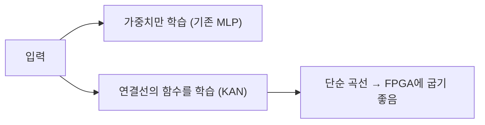

HackerNews 상단을 며칠 훑다 보면 그날 개발자들 머릿속이 어디 쏠려 있는지 대충 보이는데, 이번 주는 좀 잡탕이었다. macOS 컨테이너부터 FPGA 위에서 도는 신종 신경망, 아마존 데이터센터 네트워크, 거기에 혼자 만든 태양계 시뮬레이터까지. 인프라 무거운 얘기랑 주말 사이드 프로젝트가 한 페이지에 나란히 떠 있는 게 좀 재밌었다.

제일 먼저 눈에 들어온 건 **macOS Container Machines**. 맥에서 컨테이너 — 그러니까 앱이랑 그 실행 환경을 통째로 격리해서 싸 놓은 상자 같은 거 — 를 돌리는 건 원래 리눅스 VM 한 겹 깔고 그 위에서 굴리는 식이었거든. 근데 애플이 자체 컨테이너 프레임워크를 밀면서 이 구도가 조금씩 바뀌는 모양이더라. 내 환경이 Apple Silicon 맥이라 이 흐름은 솔직히 남 일이 아니다. Docker Desktop 켜 두면 노트북이 은근히 더워지는 거, 써 본 사람은 안다.

그다음이 좀 더 흥미로웠는데, **FPGA에서 Kolmogorov-Arnold Networks로 초고속 머신러닝**을 했다는 글. 단어가 좀 무섭지만 풀면 별거 아니다. FPGA는 회로를 내가 원하는 대로 바꿔 끼울 수 있는 칩이고 — 레고로 전용 계산기를 직접 조립한다고 보면 얼추 맞다 — KAN은 작년부터 ML 쪽에서 조용히 회자되던 새 신경망 구조다. 보통 신경망은 노드(뉴런)에 고정된 활성함수를 박아두고 연결선의 가중치만 학습하는데, KAN은 그 함수 자체를 연결선 위에 올려놓고 학습시킨다는 게 핵심 차이.

*[Photo by Craig Dennis on Pexels](https://www.pexels.com/@craigmdennis)*

이게 왜 FPGA랑 궁합이 좋냐면, 학습이 끝난 KAN의 함수들이 비교적 단순한 곡선으로 떨어져서 하드웨어에 그대로 구워 넣기 좋다는 거다. 곱셈 누적을 산더미처럼 쌓는 기존 방식 대신, 칩에 박은 작은 함수 테이블을 지나가게 하는 식. 지연(latency)에 민감한 신호 처리나 엣지 디바이스에서 의미가 클 것 같다. 다만 나는 직접 안 돌려봐서 실제 정확도-속도 트레이드오프가 논문 주장만큼 나오는지는 모르겠다. 이런 건 늘 production에서 한 번 깨져봐야 안다.

세 번째는 **Amazon의 대규모 평면형 데이터센터 네트워크**. 전통적으로 데이터센터 망은 피라미드처럼 계층을 쌓아 올렸는데(서버 → 랙 스위치 → 상위 스위치 → 코어), 규모가 커지면 위로 갈수록 병목이 생기더라. 평면형(flat)은 이 층을 최대한 눕혀서 어느 서버든 어느 서버든 비슷한 거리로 닿게 만드는 발상이다. 수만 대를 한 덩어리처럼 다뤄야 하는 회사 입장에선 당연한 진화 방향. 이런 글은 내가 만질 일은 없어도, 내가 호출하는 클라우드 API 뒤가 어떻게 생겼는지 한 번 그려보게 해서 좋다.

*[Photo by Taylor Vick on Unsplash](https://unsplash.com/@tvick?utm_source=blogmaker&utm_medium=referral)*

나머지 둘은 Show HN, 그러니까 자기 만든 거 자랑하는 코너에서 올라온 개인 프로젝트다. **Gravity**는 뉴턴 중력부터 아인슈타인 상대론까지 켜고 끌 수 있는 태양계 시뮬레이터고, **Nucleus**는 Nix — 빌드를 통째로 재현 가능하게 묶는 패키지 시스템 — 를 바탕으로 보안을 빡세게 조인 컨테이너 런타임이라더라. 둘 다 누가 시켜서가 아니라 그냥 궁금해서 만든 티가 나는 물건들이지.

이 다섯 개를 한 줄로 꿸 그럴듯한 결론 같은 건 솔직히 없다. 그냥, 거대 인프라 연구랑 주말에 혼자 끄적인 코드가 같은 화면에서 비슷한 관심을 받는다는 점이 이 바닥의 좀 건강한 구석 아닌가 싶다. KAN이 진짜 뜰지, 평면형 망이 표준이 될지는 더 지켜봐야 알 것 같고.

***

**참고**

- [macOS Container Machines](https://github.com/apple/container/blob/main/docs/container-machine.md)
- [Ultrafast machine learning on FPGAs via Kolmogorov-Arnold Networks](https://aarushgupta.io/posts/kan-fpga/)
- [Flat Datacenter Networks at Scale at Amazon](https://perspectives.mvdirona.com/2026/06/flat-datacenter-networks-at-scale/)
- [Show HN: Gravity – interactive solar-system simulator, from Newton to Einstein](https://qunabu.github.io/Gravity/)
- [Show HN: Nucleus – A security-hardened, Nix-native container runtime](https://github.com/sig-id/nucleus)