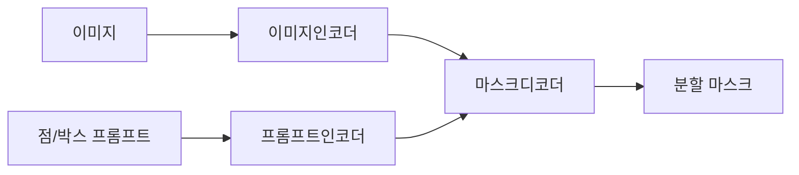

이미지에서 "이 물체만 딱 떼어내 줘" 를 거의 클릭 한 번으로 해주는 모델이 SAM(Segment Anything Model)이다. 메타가 2023년에 공개한 건데 — 이미지 분할(segmentation), 그러니까 사진 속 고양이면 고양이, 컵이면 컵만 픽셀 단위로 오려내는 작업을 범용으로 해버리는 녀석이다. 예전엔 "사람 분할용 모델", "도로 분할용 모델" 이렇게 용도별로 따로 학습시켰는데, SAM은 "뭐든 일단 오려본다" 는 쪽으로 접근을 바꿨다.

재밌는 건 입력 방식이다. 점 하나 찍거나, 대충 박스 하나 그리거나, 아니면 그냥 "전부 다 잘라봐" 하면 알아서 마스크를 뱉는다. 포토샵의 자동 선택 도구를 훨씬 똑똑하게 만든 버전이라고 보면 머릿속에 그림이 그려질 것 같다.

구조 자체는 생각보다 단순하다. 이미지를 한 번 무겁게 인코딩해두고, 사용자가 찍는 점·박스 같은 프롬프트는 가볍게 따로 인코딩해서, 둘을 합쳐 마스크를 만든다.

이 설계가 왜 영리하냐면, 무거운 이미지 인코딩은 사진당 딱 한 번만 돌리고, 그 다음부터 점을 옮겨 찍든 박스를 다시 그리든 가벼운 부분만 다시 계산하면 되거든. 그래서 클릭할 때마다 거의 실시간으로 마스크가 바뀐다. 내가 데모를 처음 만져봤을 때 이 반응 속도가 좀 신기하더라.

*[Photo by T. S. W on Unsplash](https://unsplash.com/@tissw?utm_source=blogmaker&utm_medium=referral)*

솔직히 한계도 있다. SAM은 "이게 고양이다" 같은 이름표(라벨)는 안 붙여준다. 그냥 "여기 덩어리 하나 있다" 까지만 한다. 그래서 실무에선 보통 다른 모델이 "이 영역은 강아지" 하고 짚어주면, SAM이 그 자리를 정확히 오려내는 식으로 역할을 나눠 쓰더라. 얇고 복잡한 경계 — 머리카락이나 그물망 같은 것 — 는 여전히 좀 뭉개지는 인상이고.

그래도 "분할용 데이터 라벨링" 이라는, 사람 손이 엄청 많이 가던 작업을 확 줄여준다는 점에서 닿는 곳이 많다. 의료 영상에서 장기 윤곽 따기, 영상 편집에서 배경 분리, 이런 데서 이미 쓰이고 있고. SAM 이후로 더 가볍고 빠른 후속 모델들도 계속 나오는 중이라, 이 흐름이 어디까지 갈진 좀 더 지켜봐야 할 것 같다.