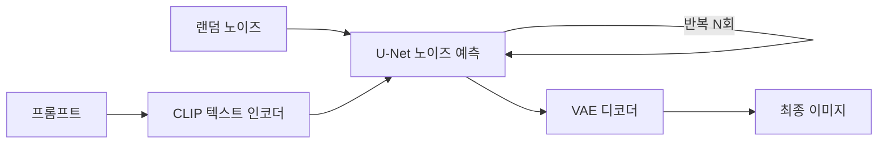

Stable Diffusion 이 이미지를 만들어내는 작동 원리를 한 번 제대로 정리해두고 싶었다. 그림 생성 AI — 글자로 "고양이 우주비행사" 라고 치면 그럴듯한 그림이 뚝 나오는 그거 — 를 제품에 붙여보면서 "이게 도대체 안에서 뭘 하는 거지?" 싶을 때가 많았거든. 마법처럼 보이지만 뜯어보면 의외로 말이 되는 구조더라.

핵심 아이디어부터. Stable Diffusion 은 **노이즈를 걷어내는 모델**이다. 좀 이상하게 들리는데, 학습 단계에서 이 모델은 멀쩡한 사진에 점점 모래폭풍 같은 노이즈를 끼얹어서 결국 완전한 백색소음으로 만드는 과정을 본다. 그리고 그 반대 방향 — "이 지저분한 이미지에서 노이즈를 한 꺼풀 벗기면 원본이 뭐였을까?" — 를 예측하도록 훈련된다. 그래서 추론할 땐 아예 순수 노이즈 한 장에서 시작해서, 그 걷어내기를 수십 번 반복하면 그림이 서서히 떠오르는 거다.

비유하자면 이렇다. 안개가 자욱한 창문 너머에 뭔가 있는데, 한 번에 다 닦지 않고 손바닥으로 조금씩 문지른다. 한 번 문지를 때마다 형체가 또렷해지고, 20~50번쯤 반복하면 풍경이 완성된다. 그 "한 번 문지르기" 가 모델이 노이즈를 예측해서 빼는 한 스텝(step)이다.

*[Photo by Tim Mossholder on Pexels](https://www.pexels.com/@timmossholder)*

재밌는 건 이름의 "Stable" 보다 더 중요한 부분이 따로 있다는 거다. 바로 **latent**, 한국어로 잠재 공간. 초기 diffusion 모델들은 512×512 픽셀을 통째로 들고 노이즈를 걷어냈는데, 이게 연산이 엄청 무겁더라. Stable Diffusion 은 영리하게 우회한다. 먼저 VAE 라는 압축기(오토인코더의 일종)로 이미지를 훨씬 작은 숫자 덩어리로 줄여놓고, 그 압축된 공간 안에서 노이즈 걷어내기를 한다. 그림이 다 만들어지면 다시 VAE 로 풀어서 픽셀로 복원. 그래서 정식 명칭이 *Latent Diffusion Model* 이다 (Rombach et al., 2022). 내 환경(RTX 4080)에서 512짜리 한 장이 몇 초 만에 나오는 것도 이 압축 덕이 크다.

그럼 "고양이 우주비행사" 라는 텍스트는 어디서 끼어드냐. 여기서 CLIP 이라는 텍스트 인코더가 등장한다. 프롬프트를 벡터로 바꿔서, 노이즈를 걷어내는 신경망(U-Net 구조)에 "이 방향으로 좀 가줘" 하고 가이드를 주는 역할이다. 매 스텝마다 U-Net 은 현재 이미지 상태와 텍스트 벡터를 같이 보면서 노이즈를 예측한다. 전체 흐름을 그림으로 그리면 대충 이렇다.

여기서 한 가지 더. 텍스트 가이드를 얼마나 세게 줄지 조절하는 값이 있는데, 흔히 CFG scale 이라고 부른다. 이게 좀 웃긴 게, 값을 너무 높이면 프롬프트는 충실히 따르는데 그림이 타버린 것처럼 부자연스러워지고, 너무 낮으면 프롬프트를 무시하고 제멋대로 간다. 보통 7 근처를 기본으로 쓰는데, 정확한 sweet spot 은 모델·프롬프트마다 달라서 결국 몇 번 돌려보고 감으로 잡게 되더라.

*[Photo by RDNE Stock project on Pexels](https://www.pexels.com/@rdne)*

왜 이게 나한테 중요했냐면 — 제품에 이미지 생성을 붙일 때 "왜 같은 프롬프트인데 결과가 매번 다르지?" 같은 질문에 답을 해야 하기 때문이다. 답은 시작점인 랜덤 노이즈(seed)가 다르기 때문이고, seed 를 고정하면 같은 그림이 재현된다. 이런 건 원리를 모르면 그냥 마법이라 넘어가지만, 알고 나면 디버깅이 된다.

한계도 짚자면, 이 구조라 손가락 개수 같은 디테일이 자주 틀리고, 스텝 수를 늘린다고 무한정 좋아지지도 않는다(어느 지점에서 수렴). 그리고 내가 여기 적은 건 SD 1.x~2.x 계열 기준이라, SDXL 이나 그 이후 모델들은 텍스트 인코더를 두 개 쓰거나 구조가 꽤 달라졌다 — 이 부분은 내가 다 따라가진 못해서 추측 섞인 영역이다.

큰 그림은 결국 "노이즈에서 형체를 끄집어낸다, 그것도 압축된 공간에서, 텍스트의 안내를 받으며" 세 줄로 줄어든다. 나머지는 이 위에 쌓인 디테일이고. 막상 정리해보니 마법보단 잘 짜인 공정에 가깝다는 인상인데, 그래도 처음 노이즈가 그림으로 변하는 걸 눈으로 보면 매번 좀 신기하긴 하다.