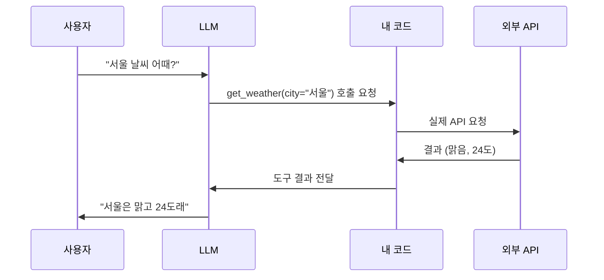

요즘 누가 "에이전트(agent)" 얘기를 꺼내면 거의 항상 그 밑에 깔려 있는 게 Tool Use다. 우리말로 풀면 "도구 사용" — LLM(거대 언어 모델, 그러니까 ChatGPT나 Claude 같은 거)이 글만 뱉는 게 아니라, 날씨 API를 부르거나 계산기를 돌리거나 DB를 뒤지는 걸 말한다. 근데 이게 처음 보면 좀 신기하거든. 텍스트만 만들어 내는 모델이 어떻게 "함수를 호출"한다는 거지?

사실은 모델이 직접 코드를 실행하는 게 아니야. 이게 좀 웃긴 게, 모델은 끝까지 글자만 만든다. 도구를 실제로 돌리는 건 그 옆에 붙은 우리 프로그램(보통 "오케스트레이터"라고 부른다)이고.

비유를 하나 들면, 모델은 종이에 쪽지를 적는 사람이야. "1번 서랍에서 오늘 환율 좀 꺼내다 줘"라고 쪽지에 적어서 책상 밖으로 슬쩍 내미는 거지. 서랍을 직접 여는 건 비서(내 코드)고. 비서가 환율을 가져와 다시 책상 위에 올려두면, 그제야 모델이 그걸 읽고 "아 1320원이네, 그럼 답은…" 하고 이어 쓴다. 모델은 서랍 근처에도 안 갔어. 쪽지만 적었을 뿐.


그럼 모델은 어떻게 "도구가 있다"는 걸 알까? 우리가 미리 알려준다. API 요청을 보낼 때 도구 목록을 같이 끼워 넣거든. 각 도구마다 이름, 설명, 그리고 어떤 인자(parameter)를 받는지를 JSON 스키마로 적어서. 예를 들면 이런 식:

```python
tools = [{
    "name": "get_weather",
    "description": "특정 도시의 현재 날씨를 가져온다",
    "input_schema": {
        "type": "object",
        "properties": {"city": {"type": "string"}},
        "required": ["city"],
    },
}]
```

이 description이 생각보다 엄청 중요하더라. 모델은 이 설명만 읽고 "지금 이 도구를 써야 하나"를 판단하니까. 설명이 두루뭉술하면 엉뚱한 타이밍에 도구를 부르거나, 부를 타이밍인데 그냥 자기 지식으로 대충 지어내 버린다. 내 경험상 description 한 줄 다듬는 게 프롬프트 열 줄 고치는 것보다 효과 좋을 때가 많았어.

흐름을 그림으로 보면 이렇게 돈다.



핵심은 화살표가 한 바퀴 돌고 **다시 모델로 돌아간다**는 점이야. 모델이 도구를 부르고 → 결과를 받고 → 그 결과를 보고 말을 잇는다. 한 번으로 안 끝날 때도 많고. 날씨를 받았더니 "그럼 우산 살 만한 가게도 찾아볼까" 하고 또 다른 도구를 부르는 식으로, 이 루프가 여러 번 돈다. 에이전트라는 게 결국 이 루프를 자동으로 계속 돌리는 거더라.


*[Photo by Peter Xie on Pexels](https://www.pexels.com/@peter-xie-371876898)*


왜 이게 우리 생활에 닿느냐면 — 모델 혼자선 "오늘" 같은 걸 모르거든. 학습 시점에 멈춰 있으니까. 내 통장 잔액도, 방금 올라온 주가도 모른다. Tool Use가 바로 그 벽을 뚫는 통로야. 모델한테 실시간 손발을 달아 주는 거지. 요즘 챗봇이 "검색해서 답해 줄게" 하는 것도 결국 검색이라는 도구를 이 방식으로 붙여 둔 거고.

주의할 점도 분명히 있다. 모델이 부른 인자를 그대로 믿고 실행하면 위험해. `delete_user(id=...)` 같은 도구를 덜컥 붙여 놨다가, 모델이 헛것을 보고 엉뚱한 id를 넘기면? 비서가 쪽지를 잘못 읽고 멀쩡한 서랍을 비워 버리는 셈이지. 그래서 실제 운영에선 위험한 도구일수록 사람 확인을 한 단계 끼우거나, 권한을 빡세게 잠가 둔다. 도구가 던지는 인자는 항상 "사용자 입력"이라고 보고 검증하는 게 안전하더라.

여기까지가 내가 만져 본 한에서의 Tool Use 골격이야. 모델은 쪽지를 적고, 코드가 서랍을 열고, 결과가 다시 모델로 돌아간다 — 이 단순한 루프 하나. 근데 이 루프 위에 어디까지 복잡한 에이전트를 쌓을 수 있느냐는, 솔직히 나도 아직 계속 실험 중이라 어떻게 굴러갈진 좀 더 봐야 할 것 같다.