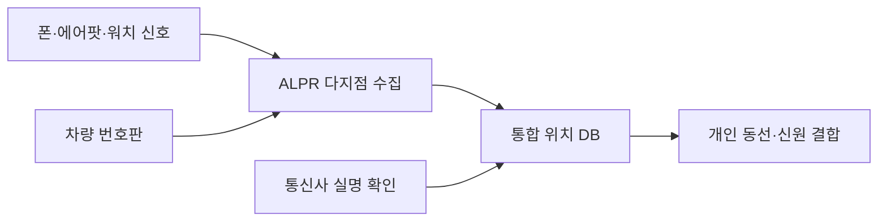

익명 선불폰, 그러니까 신분 확인 없이 현금 주고 사서 쓰는 그 "버너폰" 을 미국 FCC(연방통신위원회 — 우리로 치면 방통위 비슷한 통신 규제기관)가 사실상 없애려 한다는 얘기가 돌더라. 통신사한테 "모든 고객의 신분을 확인해라" 를 의무로 걸겠다는 거다. 마침 비슷한 시기에, 차량번호판 자동인식기(ALPR) 만드는 업체 하나가 자기 장비에 폰·에어팟·스마트워치 추적 기능을 붙이겠다고 했고. 두 뉴스가 따로 떨어져 보이는데 사실은 같은 방향을 가리킨다.

ALPR 부터 풀어보면, 길가나 신호등에 달려서 지나가는 차 번호판을 자동으로 찍어 DB에 쌓는 카메라다. 원래는 "도난 차량 잡자" 정도 명분이었는데, 이게 전국에 깔리면서 누가 언제 어디를 지나갔는지가 통째로 기록으로 남는다. 근데 거기에 이제 번호판만이 아니라 네 주머니 속 아이폰, 귀에 꽂은 에어팟, 손목의 워치가 흘리는 무선 신호까지 같이 주워담겠다는 거다.

*[Photo by Will Freeman on Pexels](https://www.pexels.com/@will-freeman-2151994913)*

이게 왜 좀 무섭냐면. 번호판은 그래도 "차" 단위라 빌려 탈 수도 있고 안 탈 수도 있다. 근데 에어팟이나 워치는 사람 몸에 거의 붙어 다니잖아. 차를 두고 걸어가도 따라온다. 게다가 블루투스·와이파이 기기는 MAC 주소 같은 고유 식별자를 주기적으로 뿌리는데(요즘은 랜덤화가 돼서 예전보단 덜하지만 완벽하진 않더라), 그걸 여러 지점에서 모으면 점이 선이 되고 동선이 된다. 내가 본 한에선, "차량 추적기" 가 슬그머니 "사람 추적기" 로 갈아타는 그림이다.

FCC 쪽도 결은 같다. 익명 선불폰의 핵심은 "내가 누군지 통신사가 모른다" 였는데, 신분 확인을 강제하면 그 익명성이 통째로 날아간다. 명분은 늘 그럴듯하다. 사기·범죄에 쓰이니까. 근데 솔직히 범죄자는 어떻게든 우회로를 찾고, 남는 건 평범한 사람들의 기본값이 "전부 신원 연결됨" 으로 바뀌는 거다.

재밌는 건, 이게 "감시 카메라 한 대 더 다는" 차원의 문제가 아니라는 점이다. 각각 떨어진 데이터는 별거 아닌데, 번호판 + 무선신호 + 실명 통신기록이 한 군데서 합쳐지는 순간 성격이 완전히 달라진다. 이건 보안 쪽에서 오래 얘기해온 거다 — 익명 데이터도 두세 개만 교차하면 사람이 특정된다는 거.

*[Photo by AI25.Studio  Studio on Pexels](https://www.pexels.com/@ai25studioai)*

내 생활에 어떻게 닿느냐. 한국은 이미 휴대폰 실명제가 오래전부터 깔려 있어서 FCC 얘기가 "그게 뭐 새삼" 싶을 수 있다. 근데 ALPR + 기기 추적 조합은 결이 다르고, 이런 장비는 국경 따져가며 안 팔린다. 한 나라에서 "정상" 이 되면 다음 나라 도입 명분이 된다.

내가 이 업체들 기술을 직접 뜯어본 건 아니라서 실제 탐지 정확도가 어느 정돈지는 모른다. 마케팅 자료의 "추적 가능" 과 현장에서 실제로 잡히는 건 늘 거리가 있더라. 다만 방향 자체가 "더 많이, 더 촘촘히, 더 영구적으로 기록" 쪽인 건 분명해 보인다. 편리하다는 말로 포장되는 것치고 한번 깔린 인프라가 되돌려진 적은 별로 없었고. 이게 어디까지 갈지는 좀 더 지켜봐야 할 것 같다.

***

**참고**

- [FCC wants to kill burner phones by forcing telecoms to get all customers' IDs](https://www.404media.co/fcc-wants-to-kill-burner-phones-by-forcing-telecoms-to-get-all-customers-ids/)
- [Company Will Add Phone, AirPod, and Smartwatch Trackers to ALPRs](https://www.404media.co/this-company-will-add-phone-airpod-and-smartwatch-trackers-to-license-plate-readers/)