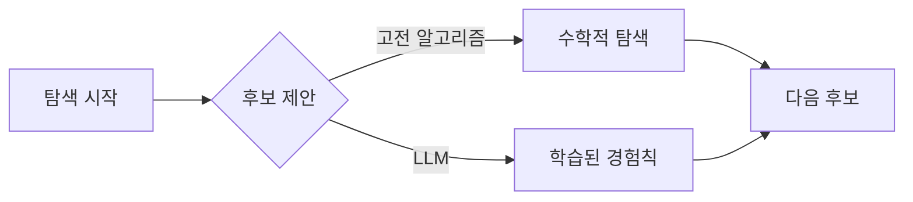

해커뉴스 AI 글 목록을 훑다가 묘하게 짝이 맞는 두 글이 나란히 올라온 걸 봤다. 하나는 "LLM이 고전 하이퍼파라미터 최적화를 이길 수 있나" — 모델 학습 전에 학습률·배치 크기 같은 손잡이 값을 뭐로 둘지 자동으로 찾아주는, 수십 년 묵은 탐색 알고리즘 얘기다. 다른 하나는 광학 수차, 그러니까 렌즈가 별빛을 살짝 일그러뜨리는 그 왜곡 패턴을 거꾸로 이용해서 진짜 천체 변광과 가짜 신호를 갈라내는 천문학 기법이고.

둘 다 분야는 전혀 안 겹치는데, 읽다 보니 같은 질문을 던지더라. *기존에 잘 돌아가던 전문 도구를, 굳이 새 각도에서 다시 의심해볼 가치가 있나?*

하이퍼파라미터 쪽부터. 솔직히 나는 처음에 좀 시큰둥했다. 베이지안 최적화나 Optuna 같은 도구가 이미 충분히 잘 한다고 믿었거든. LLM한테 "이 설정 어때?" 물어서 다음 후보를 추천받는 게, 수학적으로 잘 짜인 탐색을 정말 이긴다고? 근데 재밌는 건, 글의 결론이 "이긴다"가 아니라 "경우에 따라 비슷하게 따라온다"에 가까웠다. LLM은 사람이 쌓아둔 경험칙 — "이런 모델엔 학습률을 보통 이 근처로 둔다" 같은 — 을 어렴풋이 기억하고 있어서, 탐색 초반에 헛발질을 덜 한다는 게 핵심으로 읽혔다.

다만 이게 공짜는 아닌 게, LLM 호출 한 번이 베이지안 한 스텝보다 훨씬 비싸다. 비용 대비로 따지면 아직 명확한 승자는 없어 보이고.

천문학 글은 발상이 더 얄궂었다. 보통 렌즈 수차는 없애야 할 결함이잖나. 그런데 이 연구는 그걸 일부러 신호로 쓴다. 진짜 별에서 온 빛은 망원경 광학계를 통과하면서 특정한 모양으로 번지는데, 센서 노이즈나 우주선(cosmic ray)이 만든 가짜 점은 그 번짐 패턴을 못 따라 한다는 거지. 결함을 지문처럼 활용하는 셈이다.

*[Photo by Conner Baker on Unsplash](https://unsplash.com/@connerbaker?utm_source=blogmaker&utm_medium=referral)*

내가 두 글을 같이 묶어 본 이유가 여기 있다. 한쪽은 "사람의 직관을 기계 탐색에 다시 끼워 넣기", 다른 한쪽은 "버려야 할 노이즈를 판별 단서로 뒤집기". 둘 다 멀쩡히 돌던 파이프라인에 "근데 이거 정말 최선이야?"를 한 번 더 들이댄 작업이라는 점에서 닮았네.

당장 내 업무에 쓸 일은 없을 것 같다. 그래도 production에서 익숙한 도구를 무심코 신뢰할 때, 한 번쯤 의심의 각도를 바꿔보는 습관 — 이건 분야 안 가리고 남는 듯하다. 둘 다 후속 결과가 나오면 더 봐야 알 것 같고.

***

**참고**

- [Can LLMs Beat Classical Hyperparameter Optimization Algorithms?](https://arxiv.org/abs/2603.24647)
- [Using Optical Aberrations to Distinguish Real Astronomical Transients](https://arxiv.org/abs/2606.08319)