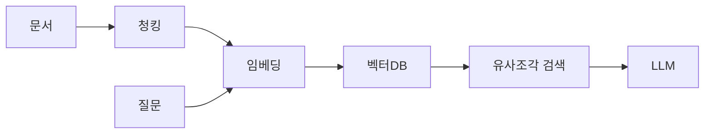

RAG 쓰다 보면 제일 먼저 막히는 게 청킹(chunking) — 긴 문서를 어떻게 잘라서 검색에 넣을지 정하는 단계더라. RAG가 뭔지부터 한 줄 풀면, 모델한테 질문할 때 관련 문서 조각을 미리 찾아 같이 던져주는 방식이다. "이 PDF 보고 답해" 하는 거. 근데 모델한테 PDF 통째로 줄 순 없으니, 문서를 잘게 잘라 벡터로 바꿔 저장해두고 질문이 들어오면 비슷한 조각만 꺼내 쓴다. 그 "잘게 자르는" 작업이 청킹이고.

사실은 여기서 첫 단추를 잘못 끼우면 뒤에 아무리 좋은 모델, 좋은 리랭커를 붙여도 잘 안 된다. 검색이 못 찾아오는 걸 모델이 메꿔줄 순 없거든.

처음 잡을 때 제일 흔한 게 **고정 길이 청킹**이다. 그냥 글자 수나 토큰 수로 뚝뚝 자르는 것. 500토큰씩, 100토큰 겹치게(overlap) — 이런 식. 단순하고 빠르다. 근데 이게 좀 웃긴 게, 문장 한가운데서 잘리거나 표 하나가 두 조각으로 쪼개지면 검색이 엉뚱하게 굴러간다. 그래서 overlap을 주는 거다. 조각 경계에 걸친 정보가 양쪽 조각에 다 들어가게.

```python
from langchain.text_splitter import RecursiveCharacterTextSplitter

splitter = RecursiveCharacterTextSplitter(
    chunk_size=500,
    chunk_overlap=100,   # 경계 정보 손실 방지
    separators=["\n\n", "\n", ". ", " "],
)
chunks = splitter.split_text(text)
```

`RecursiveCharacterTextSplitter`가 그나마 똑똑한 게, 문단(`\n\n`) → 줄(`\n`) → 문장(`. `) 순으로 자를 자리를 찾아본다는 거다. 가능하면 의미 단위를 안 깨려고. 내가 처음 RAG 붙일 때도 이걸로 시작했다.


*[Photo by Beyzanur K. on Pexels](https://www.pexels.com/@thefullonmonet)*


흐름으로 보면 대충 이렇다.



체감상 청킹 사이즈는 "정답"이 없다. 문서 성격에 달렸더라. FAQ나 짧은 정책 문서처럼 한 단락이 한 주제인 글은 작게(200~300토큰) 잘라야 검색이 또렷하다. 반대로 서사가 길게 이어지는 기술 문서는 너무 잘게 자르면 맥락이 토막 나서, 좀 크게(800토큰 이상) 가는 게 나았다. 내 환경에선 그랬다는 거고, 도메인마다 다를 거다.

요즘은 **시맨틱 청킹**도 많이 쓴다. 글자 수가 아니라 문장 임베딩을 보고 "여기서 주제가 바뀌네" 싶은 지점에서 자르는 방식. 이론상 제일 깔끔한데, 임베딩을 미리 다 돌려야 해서 비용·시간이 더 든다. 솔직히 처음부터 이걸 잡을 필요는 없는 것 같다.


*[Photo by Polina Tankilevitch on Pexels](https://www.pexels.com/@polina-tankilevitch)*


그래서 내가 후배한테 권하는 순서는 — 일단 `RecursiveCharacterTextSplitter`로 500/100 잡고 돌려본다. 그 다음 검색 결과를 눈으로 까본다. 엉뚱한 조각이 올라오면 사이즈를 줄이고, 맥락이 잘려 답이 빈약하면 키운다. 이 "눈으로 까보는" 단계를 건너뛰면 영영 감이 안 잡힌다. 숫자만 만지작거리게 되더라.

청킹은 한 번 정하고 끝나는 게 아니라, 문서가 바뀌면 다시 봐야 하는 거라고 생각하는 게 마음 편한 것 같다. 완벽한 사이즈를 찾기보다, 내 문서에 맞는 사이즈를 찾는 과정에 가까우니까. 이게 어디까지 자동화될 수 있을진 좀 더 봐야 할 것 같고.