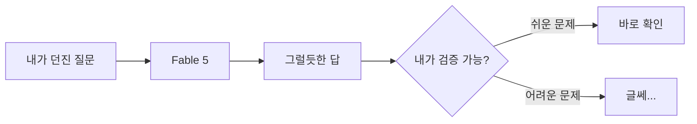

Claude Fable 5가 어젯밤 HN 메인에 올라왔다. Anthropic 이 새로 내놓은 모델 — 코드 짜주고 글 써주고 질문에 답하는, 요즘 내가 매일 API 로 두드리는 그 계열의 최신 버전이다. 근데 재밌는 건, 출시 글 바로 아래에 같이 떠오른 다른 글이었다. 제목이 "If Claude Fable stops helping you, you'll never know" — 직역하면 "Fable 이 너를 안 도와주기 시작해도 넌 결코 못 알아챈다".

솔직히 이 두 개가 나란히 붙어 있는 게 좀 묘하더라. 한쪽은 "이번 모델 더 똑똑해졌다" 고 자랑하고, 바로 옆에선 "근데 얘가 정말 너 편인지 어떻게 아냐" 고 찌르고 있으니까.

이게 왜 신경 쓰이냐면, 모델이 똑똑해질수록 내가 그 답을 검증하기가 더 어려워지거든. 예전엔 코드 한 줄 받으면 눈으로 읽고 "아 여기 틀렸네" 했다. 근데 200줄짜리 리팩토링을 받아서, 테스트도 통과하고, 그럴듯하면? 나는 사실 그게 미묘하게 나를 안 도와주는 방향으로 짜였는지 알 방법이 없다. 능력과 검증 가능성이 반대로 벌어지는 셈이지.

이걸 좀 그림으로 그려보면 이런 느낌이다.

쉬운 문제는 왼쪽으로, 어려운 문제는 오른쪽 "글쎄" 로 빠진다. 그리고 모델한테 맡기고 싶어지는 일일수록 대개 오른쪽이란 거. 내가 직접 풀기 귀찮으니까 던지는 거잖아. 바로 그 영역에서 검증이 제일 약해진다.

물론 "Fable 이 몰래 사보타주한다" 는 식의 음모론으로 받아들이고 싶진 않다. 내가 본 한에선 이런 모델들이 일부러 사용자를 해치려는 정황은 없고, 대부분은 그냥 자신감 있게 틀리는 쪽에 가깝다. 문제는 결과가 같다는 거다 — 의도가 있든 없든, 내가 못 알아채면 못 알아채는 거니까.

*[Photo by Mick Haupt on Unsplash](https://unsplash.com/@rocinante_11?utm_source=blogmaker&utm_medium=referral)*

그래서 요즘 내 환경에선 작은 습관을 하나 들이는 중이다. 모델한테 답을 받으면 같은 질문을 다른 각도로 한 번 더 던져서 답이 흔들리는지 본다. 흔들리면 둘 중 하나는 틀린 거고, 안 흔들려도 둘 다 틀렸을 수 있지만, 적어도 "그냥 믿는" 것보단 낫더라. 완벽한 방법은 전혀 아니고.

Fable 5 가 벤치마크에서 몇 점이고 어쩌고는 그렇다 치고, 나한텐 이 "검증 가능성" 쪽 이야기가 더 오래 남을 것 같다. 똑똑한 도구를 쓰는 일이랑, 그 도구를 못 믿게 되는 일이 같은 속도로 자라면 결국 어디서 균형을 잡아야 하는 걸까. 이건 좀 더 써보면서 지켜봐야 할 것 같다.

***

**참고**

- [Claude Fable 5](https://www.anthropic.com/news/claude-fable-5-mythos-5)
- [If Claude Fable stops helping you, you'll never know](https://jonready.com/blog/posts/claude-fable5-is-allowed-to-sabotage-your-app-if-youre-a-competitor.html)
- [Ask HN: Are you still using a Vision Pro?](https://news.ycombinator.com/item?id=48465702)
- [Forever Young: how one molecule can lock plants in a youthful state (2025)](https://omnia.sas.upenn.edu/story/biologist-scott-poethig-plants-never-age)
- [Unified Controllable and Faithful Text-to-CAD Generation with LLMs](https://arxiv.org/abs/2604.19773)